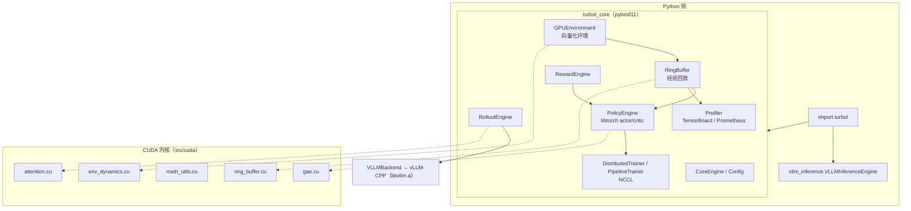

# TurboRL

[](https://github.com/DeRuiChen258/Turbol/actions/workflows/ci.yml)
[](LICENSE)
[](turbol_vllm/CMakeLists.txt)
[](turbol_vllm/CMakeLists.txt)
[](turbol_vllm/python/setup.cfg)

**GPU 原生的强化学习（RL）与 RLHF 基础设施，用 C++23 + CUDA 13.2 实现，并提供 Python 入口。**

TurboRL 把「环境交互 → 经验回放 → rollout 推理 → 奖励计算 → 策略训练 → 分布式通信」整条链路
搬到 GPU 上执行，避免传统 RL 框架在 CPU 与 GPU 之间反复搬运数据；同时用 pybind11 暴露
`import turbol` 的 Python API，让算法侧不必写 C++。

```text
TurboRL = RL Infra + RLHF Infra + CUDA HPC + LLM Inference + Distributed Training
```

---

## 目录

- [1. 为什么需要 TurboRL](#1-为什么需要-turborl)
- [2. 仓库结构：两个版本](#2-仓库结构两个版本)
- [3. 快速开始](#3-快速开始)
  - [3.1 环境要求](#31-环境要求)
  - [3.2 最小 CPU 版（零外部依赖，2 分钟）](#32-最小-cpu-版零外部依赖2-分钟)
  - [3.3 完整版（CUDA + libtorch）](#33-完整版cuda--libtorch)
  - [3.4 Python 包与绑定](#34-python-包与绑定)
  - [3.5 运行测试与基准](#35-运行测试与基准)
- [4. 架构](#4-架构)
  - [4.1 总体架构](#41-总体架构)
  - [4.2 一次 RLHF 训练迭代的数据流](#42-一次-rlhf-训练迭代的数据流)
  - [4.3 模块职责](#43-模块职责)
  - [4.4 目录结构](#44-目录结构)
- [5. 模块与 API](#5-模块与-api)
- [6. 构建选项](#6-构建选项)
- [7. 基准测试（实测数据）](#7-基准测试实测数据)
- [8. 测试](#8-测试)
- [9. 与 vLLM-CPP 的关系](#9-与-vllm-cpp-的关系)
- [10. 技术规格](#10-技术规格)
- [11. 当前状态与路线图](#11-当前状态与路线图)
- [12. 已知限制](#12-已知限制)
- [13. 贡献指南](#13-贡献指南)
- [14. 许可证与引用](#14-许可证与引用)

---

## 1. 为什么需要 TurboRL

现有 RL/RLHF 工具链的共同痛点：

| 痛点 | 表现 | TurboRL 的做法 |
| --- | --- | --- |
| **碎片化** | Gymnasium 环境、Ray/RLlib 分布式、vLLM 推理、DeepSpeed 训练各自独立，胶水代码比算法多 | 单一 CoreEngine + 统一 `Tensor` 抽象，模块可组合也可单独使用 |
| **CPU 瓶颈** | Replay Buffer、环境 step 等热路径仍在 CPU，GPU 利用率常低于 60% | 环境、回放、rollout、奖励、GAE 均有 GPU 原生实现 |
| **接口割裂** | C++ 内核快但算法侧只写 Python | `import turbol`：C++/CUDA 内核 + pybind11 零拷贝绑定 |
| **性能主张无证据** | README 里写「高性能」但没有可复现数字 | 每个模块都有 `benchmark_components` 稳态吞吐数据 + 复现命令 |

## 2. 仓库结构：两个版本

仓库同时提供两个可独立构建的实现：

| 目录 | 定位 | 语言/依赖 | 测试 |
| --- | --- | --- | --- |
| [`turbol/`](turbol/) | **最小 CPU 版**。用于算法原型、CI、教学，构建无需 CUDA/GPU | C++17 + CMake + Threads（测试需 GoogleTest） | 17 个用例，100% 通过 |
| [`turbol_vllm/`](turbol_vllm/) | **完整版（主开发目录）**。CUDA 内核 + libtorch 策略网络 + vLLM 推理 + NCCL + pybind11 | C++23 / C17 / CUDA C++20，CUDA 13.2（`sm_120`） | 38 个用例，100% 通过 |

> 两个目录的 `CMakeLists.txt` 相互独立，互不依赖；完整版会自动探测同级目录下的 vLLM-CPP 产物。

## 3. 快速开始

### 3.1 环境要求

| 场景 | 要求 |
| --- | --- |
| 最小 CPU 版 | CMake ≥ 3.28、支持 C++17 的 GCC 9+/Clang 10+、pthread；单元测试另需 GoogleTest |
| 完整版（必选） | CMake ≥ 3.28、支持 C++23 的编译器、**CUDA Toolkit 13.2**、NVIDIA 驱动、计算能力 ≥ 7.0 的 GPU |
| 完整版（可选） | libtorch（策略网络）、NCCL（多卡集合通信）、vLLM-CPP（真实 LLM 推理）、pybind11 + torch（Python API） |

> 默认编译 `sm_120`（Blackwell / RTX 50 系列）。其它显卡用
> `-DCMAKE_CUDA_ARCHITECTURES="86;90"` 覆盖即可。

### 3.2 最小 CPU 版（零外部依赖，2 分钟）

```bash
cmake -S turbol -B turbol/build -DCMAKE_BUILD_TYPE=Release \
      -DTURBORL_ENABLE_CUDA=OFF -DTURBORL_ENABLE_TESTS=ON
cmake --build turbol/build -j"$(nproc)"

./turbol/build/turbol_example                     # 演示程序
ctest --test-dir turbol/build --output-on-failure # 17 个单元测试
```

### 3.3 完整版（CUDA + libtorch）

```bash
# libtorch 的定位顺序：-DLIBTORCH_ROOT=... > 环境变量 $LIBTORCH_ROOT > CMake 默认搜索路径
export LIBTORCH_ROOT=/opt/libtorch                # 也可用 pip 安装的 torch 目录

cmake -S turbol_vllm -B turbol_vllm/build -G Ninja -DCMAKE_BUILD_TYPE=Release \
      -DTURBORL_ENABLE_CUDA=ON -DTURBORL_USE_LIBTORCH=ON -DTURBORL_ENABLE_TESTS=ON
cmake --build turbol_vllm/build -j"$(nproc)"

./turbol_vllm/build/turbol_example
ctest --test-dir turbol_vllm/build --output-on-failure   # 38 个单元测试
```

不需要神经网络模块时（例如只想用 CUDA 内核与回放缓冲）：

```bash
cmake -S turbol_vllm -B build-cpu-only -DCMAKE_BUILD_TYPE=Release \
      -DTURBORL_ENABLE_CUDA=ON -DTURBORL_USE_LIBTORCH=OFF
```

### 3.4 Python 包与绑定

Python 侧入口是 `import turbol`，C++ 扩展模块名为 `turbol_core`，通过 pybind11 暴露
`Tensor / GPUEnvironment / RingBuffer / PolicyEngine / RewardEngine / RolloutEngine /
DistributedTrainer / Profiler / TensorBoardWriter / PrometheusWriter`。

```bash
pip install pybind11 torch numpy                  # 构建期依赖

cmake -S turbol_vllm -B turbol_vllm/build -G Ninja -DCMAKE_BUILD_TYPE=Release \
      -DTURBORL_USE_LIBTORCH=ON -DTURBORL_ENABLE_PYTHON=ON \
      -DCMAKE_PREFIX_PATH="$(python -c 'import torch;print(torch.utils.cmake_prefix_path)')" \
      -Dpybind11_DIR="$(python -m pybind11 --cmakedir)"
cmake --build turbol_vllm/build --target turbol_core -j"$(nproc)"

PYTHONPATH=turbol_vllm/python python -c "import turbol; print(turbol.get_version())"
# 或者安装为包：cd turbol_vllm/python && pip install -e .
```

最小可用闭环（本仓库 CI 之外实测通过的调用方式）：

```python
import turbol

env = turbol.GPUEnvironment(num_envs=1024, obs_dim=4, act_dim=2, device="cuda:0")
env.reset()
obs = env.observe()                       # Tensor [1024, 4]，数据驻留 GPU
print(obs.shape().to_list(), obs.device())

buffer = turbol.RingBuffer(capacity=8192, obs_dim=4, act_dim=2, device="cuda:0")
policy = turbol.PolicyEngine(obs_dim=4, act_dim=2, device="cuda:0")
policy.initialize()

action, logprob = policy.forward(obs)
next_obs, reward, done = env.step(action)
buffer.push_batch(obs, action, reward, done)
```

端到端示例脚本（rollout → 回放 → 采样 → 策略更新 → TensorBoard/Chrome Trace 导出）：

```bash
python turbol_vllm/examples/py/ppo_example.py \
    --num-envs 256 --rollout-steps 32 --batch-size 64 --num-updates 200 --device cuda:0

python turbol_vllm/examples/py/grpo_example.py     # RLHF/GRPO 流程
```

另外提供 `turbol.vllm_inference.VLLMInferenceEngine`：用 vLLM 的 **Python** API 推理
（含 DeepSeek 蒸馏系列预设）。`vllm` 缺失时自动退化为确定性 echo 后端，方便无 GPU 环境调试。

### 3.5 运行测试与基准

```bash
# C++ 测试
ctest --test-dir turbol/build --output-on-failure          # 17 tests
ctest --test-dir turbol_vllm/build --output-on-failure     # 38 tests

# 组件级稳态吞吐基准（先预热、后计时）
./turbol_vllm/build/benchmark_components --device cpu
./turbol_vllm/build/benchmark_components --device cuda --num-envs 4096 --steps 500 --batch 256

# 专项微基准
./turbol_vllm/build/benchmark_tensor
./turbol_vllm/build/benchmark_attention
```

## 4. 架构

### 4.1 总体架构



设计原则：

1. **GPU 常驻**：观测、动作、奖励、GAE 全部在设备内存中流转，不产生隐式主机拷贝（CPU 版走同一套接口）。
2. **松耦合**：每个模块（env / replay / rollout / reward / policy / distributed）都能独立实例化。
3. **零拷贝互操作**：`utils/torch_interop.hpp` 提供 `AsTorchView` / `ToTorch`，Python 侧可直接拿到 torch 视图。
4. **可测可量**：每个模块都有 GoogleTest 用例，性能敏感路径有 `benchmark_components` 稳态基准。

### 4.2 一次 RLHF 训练迭代的数据流

```text
Dataset ──prompt──▶ RolloutEngine ──VLLMBackend──▶ vLLM-CPP(生成 response)
                          │
                          ▼
                    RewardEngine ──规则打分 + KL 惩罚──▶ rewards [batch]
                          │
                          ▼
                    RingBuffer ◀── (obs, act, reward, done) ── GPUEnvironment
                          │
                          ▼
                 GAE kernel ──▶ advantages / returns
                          │
                          ▼
                    PolicyEngine.Update ──▶ 新策略权重
                          │
                          ▼
           DistributedTrainer.AllReduce（多卡）
                          │
                          ▼
                    Profiler 打点 ──▶ TensorBoard / Chrome Trace / Prometheus
```

### 4.3 模块职责

| 模块 | 头文件 | 职责 |
| --- | --- | --- |
| **Core Engine** | `core/core_engine.hpp` | 单例编排器：模块注册、初始化、运行、同步 |
| **Config** | `core/config.hpp` | 类型化键值配置，`Save`/`Load` 文本格式 |
| **GPU Environment** | `env/gpu_environment.hpp` | 向量化环境（每环境一线程/一 lane），`Reset`/`Step`/`Observe` |
| **CUDA Replay Buffer** | `replay_buffer/ring_buffer.hpp` | 定容环形缓冲，O(1) 写入 + 均匀采样，CPU/CUDA 双路径 |
| **Rollout Engine** | `rollout/rollout_engine.hpp` | LLM 推理编排，`Generate`/`GenerateBatch`，经 VLLMBackend 调真实引擎 |
| **VLLM Backend** | `rollout/vllm_backend.hpp` | 封装 vLLM-CPP；不可用时优雅降级 |
| **Reward Engine** | `reward/reward_engine.hpp` | 规则打分 + KL 惩罚 + 自适应 KL + 归一化 + 截断 |
| **Policy Engine** | `policy/policy_engine.hpp` | libtorch 高斯 actor/critic：`Forward`/`GetValue`/`Update` |
| **Dataset** | `dataset/dataset.hpp` | 流式 JSONL 加载（字节偏移 seek）、批处理、与回放对齐 |
| **Distributed** | `distributed/*.hpp` | NCCL 集合通信；`PipelineTrainer` 提供 GPipe 风格微批调度 |
| **Profiler** | `profiler/*.hpp` | CPU/CUDA 计时、Chrome Trace、TensorBoard、Prometheus |
| **Tensor / utils** | `common.hpp`、`utils/` | 统一 CPU/CUDA 张量、元素级算子、torch 零拷贝互操作 |

### 4.4 目录结构

```text
Turbol/
├── README.md                       # 本文件
├── LICENSE / CONTRIBUTING.md / CODE_OF_CONDUCT.md / SECURITY.md
├── .github/workflows/ci.yml        # CI：CPU 作业 + CUDA 容器作业
├── docs/
│   ├── SPECIFICATION.md            # 详细设计规格（架构、类图、Kernel、Roadmap）
│   ├── IMPROVEMENT_PLAN.md         # 后续改进计划（P0–P2 与验收证据）
│   └── PROJECT_PROMPT.md           # 项目初始设计提示词
│
├── turbol/                         # 最小 CPU 版（C++17，无外部依赖）
│   ├── include/turbol/             # 公共头文件
│   ├── src/                        # 实现
│   ├── tests/ benchmarks/ examples/
│   └── CMakeLists.txt
│
└── turbol_vllm/                    # 完整版（主开发目录）
    ├── include/turbol/
    │   ├── common.hpp              # Status / Shape / Device / DataType / Tensor
    │   ├── core/ env/ replay_buffer/ rollout/ reward/ policy/ dataset/
    │   ├── distributed/ profiler/ utils/
    ├── src/
    │   ├── cuda/                   # attention / ring_buffer / math_utils / env_dynamics / gae
    │   └── core/ env/ replay_buffer/ rollout/ reward/ policy/ dataset/
    │       distributed/ profiler/ utils/
    ├── python/                     # pybind11 绑定 + turbol 包（setup.cfg）
    ├── tests/                      # 38 个 GoogleTest 用例
    ├── benchmarks/                 # benchmark_tensor / attention / components
    ├── examples/                   # C++ 示例与 examples/py（PPO、GRPO）
    └── CMakeLists.txt
```

## 5. 模块与 API

### 5.1 Tensor 与 Config

```cpp
#include "turbol/common.hpp"
#include "turbol/core/config.hpp"
using namespace turborl;

Tensor t(Shape({256, 4}), DataType::kFloat32, Device::CUDA(0));
float* p = t.data<float>();          // 类型化访问
Tensor cpu_copy = t.ToDevice(Device::CPU());
Tensor clone = t.Clone();

Config cfg;
cfg.Set("learning_rate", 1e-4f);
cfg.Set("use_amp", true);
float lr = cfg.Get<float>("learning_rate", 3e-4f);   // 缺省值兜底
cfg.Save("/tmp/train.cfg");
cfg.Load("/tmp/train.cfg");
```

### 5.2 GPU 环境

```cpp
#include "turbol/env/gpu_environment.hpp"
using namespace turborl::env;

GPUEnvironment env(/*num_envs=*/256, /*obs_dim=*/4, /*act_dim=*/2, Device::CUDA(0));
env.Reset();
Tensor obs = env.Observe();                   // [256, 4]

Tensor action(Shape({256, 2}), DataType::kFloat32, Device::CUDA(0));
Tensor next_obs, reward, done;
env.Step(action, &next_obs, &reward, &done);  // s' = decay·s + force·a, r = -||s'||²
```

### 5.3 经验回放

```cpp
#include "turbol/replay_buffer/ring_buffer.hpp"
using namespace turborl::replay_buffer;

RingBuffer buffer(/*capacity=*/100000, /*obs_dim=*/128, /*act_dim=*/8, Device::CUDA(0));
buffer.Push(obs, act, reward, /*done=*/false);
buffer.PushBatch(obs_batch, act_batch, reward_batch, done_batch);

Tensor s_obs, s_act, s_reward, s_done;
buffer.Sample(/*batch_size=*/256, &s_obs, &s_act, &s_reward, &s_done);   // 有放回均匀采样
```

### 5.4 策略引擎（libtorch）

```cpp
#include "turbol/policy/policy_engine.hpp"
using namespace turborl::policy;

PolicyEngine policy(/*obs_dim=*/4, /*act_dim=*/2, Device::CUDA(0));
policy.Initialize();

Tensor action, logprob, value;
policy.Forward(obs, &action, &logprob);       // a ~ N(tanh(W·obs+b), σ²)
policy.GetValue(obs, &value);                 // critic V(s)

// batch 布局：[N, obs_dim + act_dim + 2] = [obs | action | advantage | return]
policy.Update(batch);
```

### 5.5 Rollout 与 vLLM 后端

```cpp
#include "turbol/rollout/rollout_engine.hpp"
using namespace turborl::rollout;

RolloutConfig config;
config.inference_backend = "vllm";
config.model_path = "./models/Qwen2.5-0.5B-Instruct";
config.max_new_tokens = 256;

RolloutEngine engine(config);
engine.Initialize();

std::string out;
engine.Generate("Hello, world!", &out);       // 无模型/GPU 时降级为回退后端

std::vector<std::string> prompts{"a", "b", "c"}, outs;
engine.GenerateBatch(prompts, &outs);
```

### 5.6 奖励引擎（RLHF）

```cpp
#include "turbol/reward/reward_engine.hpp"
using namespace turborl::reward;

RewardConfig cfg;                 // kl_coef / kl_target / adaptive_kl /
                                  // normalize / reward_clip / 规则权重
cfg.device = Device::CUDA(0);
cfg.normalize = true;

RewardEngine engine(cfg);
engine.Initialize();

RewardResult result;
engine.ScoreBatch(responses, std::nullopt, &result);
// result.total / rule_scores / model_scores / kl_penalties 均为 [batch] 张量
engine.UpdateAdaptiveKL(/*observed_kl=*/0.12f);
float coef = engine.CurrentKLCoef();
```

### 5.7 数据集

```cpp
#include "turbol/dataset/dataset.hpp"
using namespace turborl::dataset;

DatasetConfig cfg;                 // data_paths / max_seq_length / shuffle
Dataset ds(cfg);
ds.Initialize();                   // 流式 JSONL 加载
while (ds.HasNext()) {
    PreprocessedBatch b;
    ds.NextBatch(&b);              // input_ids / attention_mask / labels
}
```

### 5.8 剖析器

```cpp
#include "turbol/profiler/profiler.hpp"
using namespace turborl::profiler;

Profiler profiler;
auto id = profiler.BeginSpan("rollout", "compute", /*device_id=*/0);
profiler.EndSpan(id);

{
    Profiler::Guard g(&profiler, "policy_update");   // RAII 自动收尾
}

profiler.ExportChromeTrace("/tmp/trace.json");       // chrome://tracing
profiler.PrintSummary();
```

`TensorBoardWriter`（自写最小 protobuf Event，无外部 TB 依赖）与 `PrometheusWriter`
（text exposition 格式）位于 `profiler/tensorboard_writer.hpp`。

### 5.9 分布式与流水线

```cpp
#include "turbol/distributed/distributed_trainer.hpp"
#include "turbol/distributed/pipeline_trainer.hpp"
using namespace turborl::distributed;

DistributedConfig dcfg;  dcfg.rank = 0;  dcfg.world_size = 2;  dcfg.use_nccl = true;
DistributedTrainer trainer(dcfg);
trainer.Initialize();
trainer.AllReduce(&t, "mean");
trainer.Broadcast(&t, /*root_rank=*/0);
trainer.Shutdown();

PipelineConfig pcfg;     // num_pipeline_stages / num_microbatches / stage_id
PipelineTrainer ptrainer(pcfg);
ptrainer.Initialize();
float avg_loss = 0.0f;
ptrainer.TrainingStep(&avg_loss);   // GPipe 风格微批调度
```

### 5.10 CUDA 内核

| 文件 | 功能 | 实现要点 |
| --- | --- | --- |
| `src/cuda/attention.cu` | 缩放点积注意力 | 在线 softmax，数值稳定，支持变长序列 |
| `src/cuda/ring_buffer.cu` | 环形缓冲写入 | 原子预留 + float4 向量化 |
| `src/cuda/math_utils.cu` | 元素级算子 | add / sub / fill / add_scalar / scale |
| `src/cuda/env_dynamics.cu` | 环境动力学 | 每环境一线程，线性系统 step/reset |
| `src/cuda/gae.cu` | 广义优势估计 | 每环境一线程，反向递推 |

## 6. 构建选项

### 完整版（`turbol_vllm`）

| 选项 | 说明 | 默认 |
| --- | --- | --- |
| `TURBORL_ENABLE_CUDA` | 启用 CUDA 内核与运行时 | `ON` |
| `TURBORL_USE_LIBTORCH` | 启用 libtorch 策略网络 | `ON` |
| `TURBORL_USE_NCCL` | 启用 NCCL 分布式集合通信 | `OFF` |
| `TURBORL_ENABLE_TESTS` | 构建 GoogleTest 单元测试 | `ON` |
| `TURBORL_ENABLE_BENCHMARKS` | 构建基准程序 | `ON` |
| `TURBORL_ENABLE_PYTHON` | 构建 pybind11 绑定（`turbol_core`） | `OFF` |
| `LIBTORCH_ROOT` | libtorch/torch 目录（缓存变量，支持 `$LIBTORCH_ROOT` 环境变量） | 自动探测 |
| `CMAKE_CUDA_ARCHITECTURES` | 目标计算能力 | `120` |

### 最小 CPU 版（`turbol`）

| 选项 | 说明 | 默认 |
| --- | --- | --- |
| `TURBORL_ENABLE_CUDA` | 启用 CUDA | `OFF` |
| `TURBORL_ENABLE_TESTS` | 构建单元测试 | `ON` |
| `TURBORL_ENABLE_BENCHMARKS` | 构建基准程序 | `ON` |

## 7. 基准测试（实测数据）

`benchmark_components` 对训练循环的 6 条热路径做稳态测量（先预热再计时）。
以下数据在 **RTX 5070 Laptop GPU（8 GB, `sm_120`）+ CUDA 13.2 + 驱动 615.71.09** 上实测，
每次运行 4096 环境 / 500 步 / batch 256：

```bash
./turbol_vllm/build/benchmark_components --device cpu  --num-envs 4096 --steps 500 --batch 256
./turbol_vllm/build/benchmark_components --device cuda --num-envs 4096 --steps 500 --batch 256
```

| 热路径 | CPU 吞吐 | CUDA 吞吐 | CPU ms/op | CUDA ms/op |
| --- | --- | --- | --- | --- |
| `GPUEnvironment::Step`（4096 envs） | 97,215,498 env-steps/s | **235,417,371 env-steps/s** | 0.042 | 0.017 |
| `RingBuffer::PushBatch`（256/batch） | **57,611,361/s** | 106,884/s | 0.004 | 2.395 |
| `RingBuffer::Sample`（256/batch） | **34,730,061/s** | 111,869/s | 0.007 | 2.288 |
| `PolicyEngine::Forward`（batch=256） | **10,266,746 samples/s** | 4,153,820 samples/s | 0.025 | 0.062 |
| `PolicyEngine::Update`（batch=256） | **1,546,931 samples/s** | 845,549 samples/s | 0.165 | 0.303 |
| `GAE`（T=256, envs=4096） | 27,525,353,449 env-steps/s | **36,177,977,920 env-steps/s** | 0.038 | 0.029 |

如何解读：

- **大并行度负载（环境 step、GAE）在 CUDA 上更快**，这是向量化设计的收益来源。
- **小批量、逐次同步的算子（回放的 push/sample、小 batch 策略前向）反而是 CPU 更快**：当前 CUDA
  路径为逐元素 `cudaMemcpy` + 同步，每次调用都付出一次同步代价。这正是路线图里
  「批量回放搬运 kernel」要解决的问题——把数据留在显存里、一次内核完成整批搬移。
- 这些数字是**消费级笔记本 GPU**上的量级参考，不构成数据中心性能主张。

## 8. 测试

```bash
ctest --test-dir turbol/build --output-on-failure         # 17 tests / 3 suites
ctest --test-dir turbol_vllm/build --output-on-failure    # 38 tests / 7 suites
```

`turbol_vllm` 的测试覆盖：

| 测试套件 | 覆盖内容 |
| --- | --- |
| `TensorTest` | 创建/拷贝/移动、dtype、device 语义、`ToDevice` |
| `RingBufferTest` | 定容写入、容量回绕、采样与数据一致性 |
| `RolloutTest` | Rollout 引擎构造/初始化/生成/配置 |
| `ConfigTest` | 类型化读写、默认值、Save/Load |
| `TensorUtilsTest` | 元素级算子正确性 |
| `ProfilerTest` | 计时区间、聚合统计、Chrome Trace 导出 |
| `RewardEngineTest` | 规则打分、KL 惩罚、自适应 KL、归一化 |

CI（[`.github/workflows/ci.yml`](.github/workflows/ci.yml)）执行两个作业：CPU 作业在标准
Ubuntu runner 上构建 `turbol` 并跑测试；CUDA 作业在官方 `nvidia/cuda:13.2.0-devel-ubuntu24.04`
容器中构建 `turbol_vllm`（`-DTURBORL_USE_LIBTORCH=OFF`，编译只需工具链，无需 GPU）并跑测试。

## 9. 与 vLLM-CPP 的关系

TurboRL 的 LLM 推理走两条路：

1. **C++ 路径（可选外部依赖）**：`VLLMBackend` 链接同级目录的 vLLM-CPP 静态库
   （默认查找 `<repo>/../vllm/build/libvllm.a`）。该库不随本仓库分发；缺失时
   `RolloutEngine` 自动降级到回退后端，训练环路不中断。此路径要求 `libvllm.a` 以
   `-fPIC` 编译才能链接进 Python 扩展模块。
2. **Python 路径（推荐用于 DeepSeek 等模型）**：`turbol.vllm_inference.VLLMInferenceEngine`
   直接调用 vLLM 的 Python API（`vllm.LLM`），自带 DeepSeek-R1-Distill 系列预设，
   与 C++ 引擎保持相同的 `generate` / `generate_batch` 接口。

## 10. 技术规格

| 规格 | 值 |
| --- | --- |
| 主机端 C++ 标准 | C++23（最小 CPU 版为 C++17） |
| C 标准 | C17 |
| CUDA 设备端标准 | C++20 |
| CUDA 版本 | 13.2 |
| 目标计算能力 | `sm_120`（Blackwell / RTX 50 系列），可用 `CMAKE_CUDA_ARCHITECTURES` 覆盖 |
| 神经网络库 | libtorch（PyTorch 2.12+ 的 C++ 前端；本机验证 torch 2.13.0+cu132） |
| 分布式通信 | NCCL 2.x（可选，`-DTURBORL_USE_NCCL=ON`） |
| LLM 推理 | vLLM-CPP（C++）或 vLLM Python API |
| Python 绑定 | pybind11（Python 3.9+；本机验证 3.12.13 + pybind11 3.1.0） |
| 构建系统 | CMake 3.28+ / Ninja |
| 测试框架 | GoogleTest |

## 11. 当前状态与路线图

### 已完成

- [x] 构建系统现代化（C++23 / C17 / CUDA 13.2 / `sm_120`，架构可覆盖）
- [x] `common.hpp` 基础类型与类型化张量访问
- [x] Config、RingBuffer、TensorUtils、DistributedTrainer 真实实现（CPU + CUDA 双路径）
- [x] GPUEnvironment 向量化环境（Reset / Step / Observe）
- [x] PolicyEngine（libtorch actor/critic：Forward / GetValue / Update）
- [x] VLLMBackend 接入真实 `vllm::Engine`，无模型/GPU 时优雅降级
- [x] CUDA 内核：FlashAttention 在线 softmax、向量化环形缓冲、GAE
- [x] RewardEngine（规则打分 + KL 惩罚 + 自适应 KL + 归一化）
- [x] Dataset 模块（流式 JSONL 加载、字节偏移 seek）
- [x] Profiler（CPU/CUDA 计时、Chrome Trace）+ TensorBoard / Prometheus Writer
- [x] PipelineTrainer（GPipe 风格微批调度）
- [x] Python API（pybind11 `turbol_core` + `turbol` 包），PPO / GRPO 示例端到端可跑
- [x] 微基准套件 `benchmark_components`（6 条热路径稳态吞吐）
- [x] 单元测试：`turbol` 17 个、`turbol_vllm` 38 个，全部通过

### 规划中

- [ ] 批量回放搬移 kernel：消除 CUDA 路径下逐元素 `cudaMemcpy` + 同步的开销
- [ ] 更多计算内核（CUTLASS GEMM、FlashAttention-2/3），以 Profiler 定位瓶颈后按需引入
- [ ] 多机分布式与 Pipeline Parallel 运行时（NCCL 后端 + 启动器）
- [ ] 奖励模型推理（Reward Model 前向接入 libtorch）
- [ ] 端到端公开 benchmark：与等价 RL/RLHF 场景对比吞吐、延迟、显存占用

详细设计见 [`docs/SPECIFICATION.md`](docs/SPECIFICATION.md)，
优先级与验收证据见 [`docs/IMPROVEMENT_PLAN.md`](docs/IMPROVEMENT_PLAN.md)。

## 12. 已知限制

1. **CUDA 回放路径吞吐低于 CPU**：`PushBatch`/`Sample` 在 CUDA 上是逐元素 `cudaMemcpy` +
   同步，实测约 1×10⁵ transitions/s（CPU 约 5.8×10⁷），修复项在路线图中。
2. **小 batch 的策略前向/更新暂时 CPU 更快**：CUDA 路径每次调用都有 kernel 启动与同步开销，
   batch ≥ 数千时才体现优势。
3. **单机**：NCCL 已接入并提供集合通信 API，但没有多机启动器与容错。
4. **vLLM-CPP 不随仓库分发**：C++ 推理路径需自备 `libvllm.a`（且需 `-fPIC` 才能进 Python 扩展）。
5. **基准数据来自消费级笔记本 GPU**（RTX 5070 Laptop 8 GB），非数据中心量级。
6. **最小 CPU 版是精简实现**：只有 CPU 路径的基础设施，无 CUDA / vLLM / 策略网络 / Profiler。
7. **Python 包发布形态**：目前以源码方式使用（`PYTHONPATH` 或 `pip install -e`），尚未发布到 PyPI。

## 13. 贡献指南

```bash
# 1. 先跑通 CPU 测试（最快反馈回路）
cmake -S turbol -B turbol/build -DCMAKE_BUILD_TYPE=Release -DTURBORL_ENABLE_CUDA=OFF
cmake --build turbol/build -j"$(nproc)" && ctest --test-dir turbol/build

# 2. 有 GPU 时再跑完整版
cmake -S turbol_vllm -B turbol_vllm/build -G Ninja -DCMAKE_BUILD_TYPE=Release
cmake --build turbol_vllm/build -j"$(nproc)" && ctest --test-dir turbol_vllm/build
```

约定：

- 遵循 Google C++ Style；C++ 侧保持 C++23 / C++17（按目录）一致，Python 侧遵循 PEP 8。
- 新增功能必须带测试；性能相关改动必须用 `benchmark_components` 给出前后对比数字。
- 提交信息用动词开头（`Add` / `Fix` / `Update` / `Remove`），并在需要时引用 issue。

细节见 [`CONTRIBUTING.md`](CONTRIBUTING.md)、[`CODE_OF_CONDUCT.md`](CODE_OF_CONDUCT.md) 与
[`SECURITY.md`](SECURITY.md)。

## 14. 许可证与引用

本项目基于 **Apache License 2.0** 发布，见 [`LICENSE`](LICENSE)。

```bibtex
@software{turborl,
  title        = {TurboRL: High Performance RL & RLHF Infrastructure},
  author       = {TurboRL Team},
  year         = {2026},
  version      = {1.0.0},
  url          = {https://github.com/DeRuiChen258/Turbol}
}
```
