# TurboRL — 工业级高性能 RL & RLHF 基础设施规格文档

> **项目名称**: TurboRL
> **副标题**: High Performance RL & RLHF Infrastructure powered by CUDA and C++
> **版本**: v1.0-dev
> **作者**: TurboRL Team
> **日期**: 2026-08-12
> **状态**: 设计阶段

---

## 目录

1. [项目概述与愿景](#1-项目概述与愿景)
2. [总体架构设计](#2-总体架构设计)
3. [模块详细设计](#3-模块详细设计)
   - 3.1 [Core Engine](#31-core-engine)
   - 3.2 [GPU Environment](#32-gpu-environment)
   - 3.3 [CUDA Replay Buffer](#33-cuda-replay-buffer)
   - 3.4 [RLHF Rollout Engine](#34-rlhf-rollout-engine)
   - 3.5 [Reward Engine](#35-reward-engine)
   - 3.6 [Policy Engine](#36-policy-engine)
   - 3.7 [Distributed Engine](#37-distributed-engine)
   - 3.8 [Dataset Module](#38-dataset-module)
   - 3.9 [Profiler Module](#39-profiler-module)
   - 3.10 [Benchmark Module](#310-benchmark-module)
   - 3.11 [Python API Layer](#311-python-api-layer)
4. [CUDA Kernel 设计](#4-cuda-kernel-设计)
5. [内存管理与性能优化](#5-内存管理与性能优化)
6. [分布式训练架构](#6-分布式训练架构)
7. [RLHF Pipeline 全流程](#7-rlhf-pipeline-全流程)
8. [API 设计规范](#8-api-设计规范)
9. [Benchmark 设计](#9-benchmark-设计)
10. [CI/CD 与工程规范](#10-cicd-与工程规范)
11. [完整开发 Roadmap](#11-完整开发-roadmap)
12. [README & 社区文档](#12-readme--社区文档)

---

## 1. 项目概述与愿景

### 1.1 项目背景

TurboRL 是一个面向下一代强化学习（RL）和基于人类反馈的强化学习（RLHF）工作负载的工业级基础设施项目。当前 RL/RLHF 领域的开源工具链存在以下痛点：

- **碎片化严重**: Gym/Gymnasium 环境、Ray/RLlib 分布式、vLLM 推理、DeepSpeed 训练各自独立，缺乏统一基础设施。
- **CPU 瓶颈**: Replay Buffer、Environment Stepping 等关键路径仍依赖 CPU，GPU 利用率不足 60%。
- **扩展性不足**: 缺乏对千卡级以上 RLHF 训练的原生支持。
- **工程标准参差**: 缺少统一的 Profiler、Benchmark、CI/CD 体系。

TurboRL 的目标是填补这一空白，提供从环境交互、经验回放、策略推理到分布式训练的全链路 GPU Native 解决方案。

### 1.2 项目愿景

```text
TurboRL = RL Infrastructure + RLHF Infrastructure + CUDA HPC + LLM Inference + Distributed Training
```

**核心定位**:

- 支持传统 RL（DQN、PPO、SAC、TD3 等）、Offline RL（CQL、IQL 等）、RLHF（PPO、DPO、GRPO）、Agent RL
- 全链路 GPU 加速：Environment → Replay Buffer → Rollout → Reward → Policy 均运行在 GPU 上
- C++17 + CUDA 13.x 核心实现，pybind11 + Torch Extension 提供 Python API
- 深度集成 vLLM、SGLang、TensorRT-LLM 实现高性能 LLM 推理

### 1.3 技术栈

| 层级        | 技术选型                       | 说明                    |
| --------- | -------------------------- | --------------------- |
| 核心语言      | C++17                      | 高性能、跨平台、现代特性          |
| GPU 编程    | CUDA 13.x                  | 最新 CUDA 特性、CUTLASS 集成 |
| Python 绑定 | pybind11 + Torch Extension | 零拷贝互操作                |
| 分布式通信     | NCCL 2.21+ / NVSHMEM       | 节点内/节点间通信             |
| 推理引擎      | vLLM, SGLang, TensorRT-LLM | 可选后端                  |
| 构建系统      | CMake 3.28+ / ninja        | 现代化构建                 |
| 包管理       | vcpkg / Conda              | 依赖管理                  |
| 文档        | Doxygen + Sphinx + Mermaid | C++/Python 文档         |
| CI/CD     | GitHub Actions + Docker    | 自动化测试与发布              |
| 代码规范      | Google C++ Style / PEP8    | 统一风格                  |

### 1.4 核心特性

```text
┌─────────────────────────────────────────────────────────────────────────┐
│                          TurboRL 核心特性                                │
├─────────────────────────────────────────────────────────────────────────┤
│  🔧 GPU Native       │  全链路 GPU 加速，消除 CPU-GPU 数据传输瓶颈         │
│  🚀 高性能            │  CUDA Kernel 深度优化，CUTLASS 矩阵运算              │
│  🧩 模块化设计        │  松耦合架构，各模块可独立使用或替换                    │
│  📡 分布式优先        │  原生支持 Data Parallel / Model Parallel / Pipeline  │
│  🧠 LLM 原生集成     │  vLLM / SGLang / TensorRT-LLM 深度集成              │
│  📊 可观测性          │  内置 Profiler、TensorBoard 集成、Prometheus 导出    │
│  🧪 完整测试体系      │  单元测试 / 集成测试 / Benchmark / 回归测试           │
│  📦 工业级 CI/CD      │  GitHub Actions + Docker + 多平台支持               │
│  🌍 开源友好          │  Apache 2.0 / 完善的贡献指南 / 社区治理              │
└─────────────────────────────────────────────────────────────────────────┘
```

---

## 2. 总体架构设计

### 2.1 系统架构总览

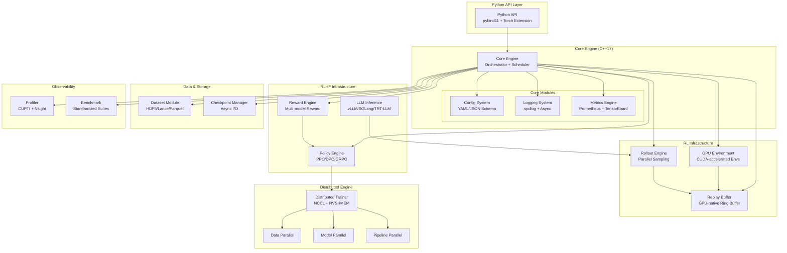

### 2.2 模块依赖关系

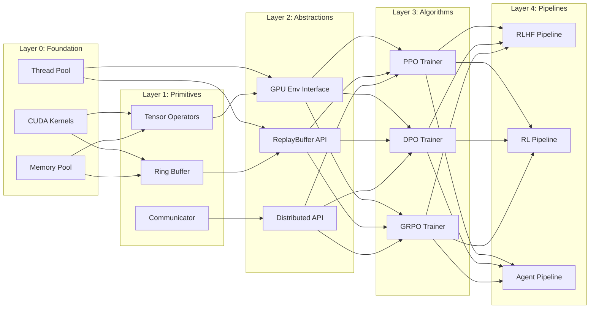

### 2.3 数据流设计

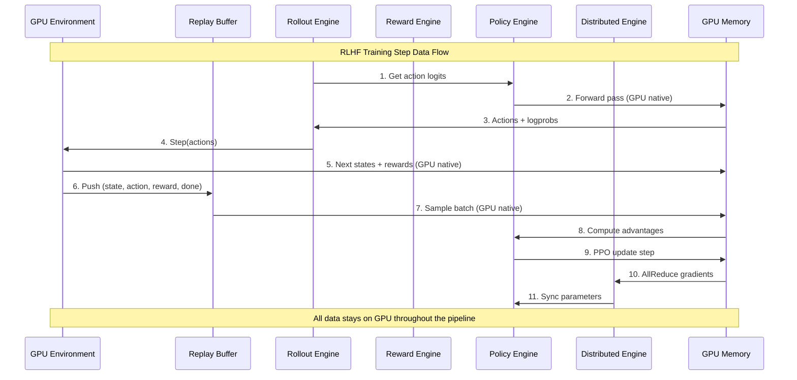

### 2.4 目录结构

```text
turborl/
├── CMakeLists.txt                    # 顶层 CMake
├── README.md
├── LICENSE
├── CONTRIBUTING.md
├── CODE_OF_CONDUCT.md
├── CHANGELOG.md
├── .github/
│   ├── workflows/                    # CI/CD workflows
│   ├── ISSUE_TEMPLATE/
│   └── PULL_REQUEST_TEMPLATE.md
├── cmake/                            # CMake 模块
│   ├── FindCUDA.cmake
│   ├── TurboRLConfig.cmake.in
│   └── CompilerSettings.cmake
├── docs/                             # 文档
│   ├── index.rst
│   ├── api/
│   ├── tutorials/
│   ├── design/
│   └── benchmarks/
├── include/turborl/                  # 公共头文件
│   ├── core/                         # Core Engine
│   ├── env/                          # GPU Environment
│   ├── replay_buffer/                # Replay Buffer
│   ├── rollout/                      # Rollout Engine
│   ├── reward/                       # Reward Engine
│   ├── policy/                       # Policy Engine
│   ├── distributed/                  # Distributed Engine
│   ├── dataset/                      # Dataset Module
│   ├── profiler/                     # Profiler
│   ├── benchmark/                    # Benchmark
│   ├── cuda/                         # CUDA Kernels
│   ├── memory/                       # Memory Management
│   ├── utils/                        # Utilities
│   └── python/                       # Python bindings
├── src/                              # 实现文件
│   ├── core/
│   ├── env/
│   ├── replay_buffer/
│   ├── rollout/
│   ├── reward/
│   ├── policy/
│   ├── distributed/
│   ├── dataset/
│   ├── profiler/
│   ├── benchmark/
│   ├── cuda/
│   ├── memory/
│   └── utils/
├── python/                           # Python 包
│   ├── turborl/
│   │   ├── __init__.py
│   │   ├── env.py
│   │   ├── replay_buffer.py
│   │   ├── rollout.py
│   │   ├── reward.py
│   │   ├── policy.py
│   │   ├── distributed.py
│   │   ├── dataset.py
│   │   └── profiler.py
│   └── setup.py
├── tests/                            # 测试
│   ├── unit/
│   ├── integration/
│   ├── benchmark/
│   └── regression/
├── benchmarks/                       # Benchmark suites
├── examples/                         # 示例代码
├── scripts/                          # 辅助脚本
├── docker/                           # Docker 配置
├── third_party/                      # 第三方依赖
└── tools/                            # 开发工具
```

---

## 3. 模块详细设计

### 3.1 Core Engine

#### 3.1.1 职责

Core Engine 是 TurboRL 的中央调度器，负责：

1. **生命周期管理**: 初始化/销毁所有子模块
2. **配置加载与校验**: 基于 JSON Schema 的配置系统
3. **任务调度**: 异步任务图（TaskGraph）执行
4. **线程池管理**: CPU 线程池 + CUDA Stream 池
5. **日志与度量**: 统一的观测接口

#### 3.1.2 类图

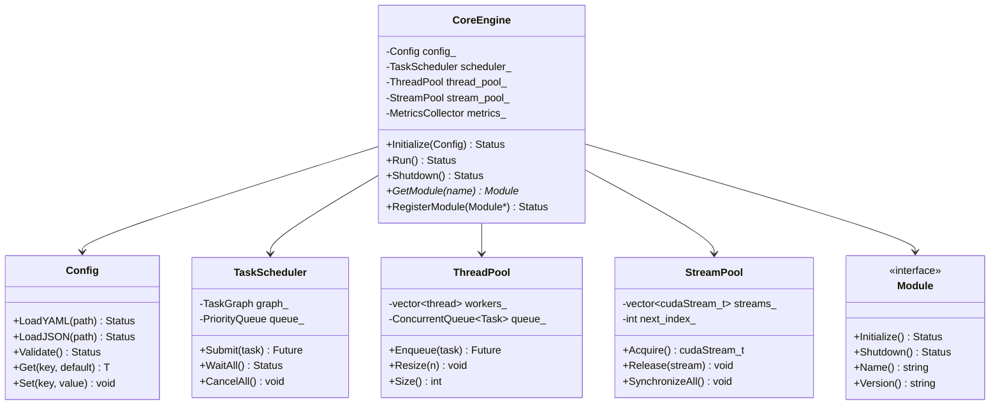

#### 3.1.3 核心数据结构

```cpp
// Core Engine 核心配置
struct CoreConfig {
    int num_cpu_threads = std::thread::hardware_concurrency();
    int num_cuda_streams = 32;
    int gpu_device_id = 0;
    std::string log_level = "info";
    std::string log_dir = "/tmp/turborl_logs";
    bool enable_profiling = false;
    bool enable_metrics = true;
};

// 任务定义
struct Task {
    std::string name;
    std::function<Status()> func;
    int priority = 0;
    std::vector<std::string> dependencies;
    cudaStream_t stream = nullptr;  // 可选 CUDA stream
};

// 任务图（DAG）
class TaskGraph {
    struct Node {
        Task task;
        std::vector<Node*> children;
        std::vector<Node*> parents;
        Status status = Status::Pending;
    };
    std::unordered_map<std::string, std::unique_ptr<Node>> nodes_;
};
```

#### 3.1.4 API

```cpp
// Core Engine Public API
class CoreEngine {
public:
    // 单例模式
    static CoreEngine& Instance();

    // 初始化
    Status Initialize(const std::string& config_path);
    Status Initialize(const CoreConfig& config);

    // 注册模块
    template<typename T, typename... Args>
    Status RegisterModule(const std::string& name, Args&&... args);

    // 获取模块
    template<typename T>
    T* GetModule(const std::string& name);

    // 运行主循环
    Status Run();

    // 优雅关闭
    Status Shutdown();

    // 提交异步任务
    std::future<Status> SubmitTask(Task task);

    // 获取 CUDA Stream
    cudaStream_t AcquireStream();
    void ReleaseStream(cudaStream_t stream);

    // 同步所有操作
    Status Synchronize();

private:
    CoreEngine() = default;
    ~CoreEngine();
    // ... 实现细节
};
```

#### 3.1.5 性能考量

- 使用无锁队列（`moodycamel::ConcurrentQueue`）实现线程池任务分发
- CUDA Stream Pool 采用 round-robin 分配，避免 Stream 创建开销
- 配置热加载：支持运行时动态更新部分配置项
- 启动延迟 < 100ms（从 `Initialize` 到 `Run`）

---

### 3.2 GPU Environment

#### 3.2.1 职责

GPU Environment 提供在 GPU 上批量执行环境交互的能力，支持：

1. **批量环境管理**: 单个 GPU 上同时运行数千个环境实例
2. **GPU-native 状态**: Environment State 完全存储在 GPU 显存中
3. **向量化操作**: 所有环境操作（reset, step, render）均为批量向量化操作
4. **可扩展接口**: 支持 C++ 实现的环境和 Python 包装的环境
5. **常见环境集成**: Gym/Gymnasium 接口兼容，Brax/Isaac 等 GPU 环境直接集成

#### 3.2.2 类图

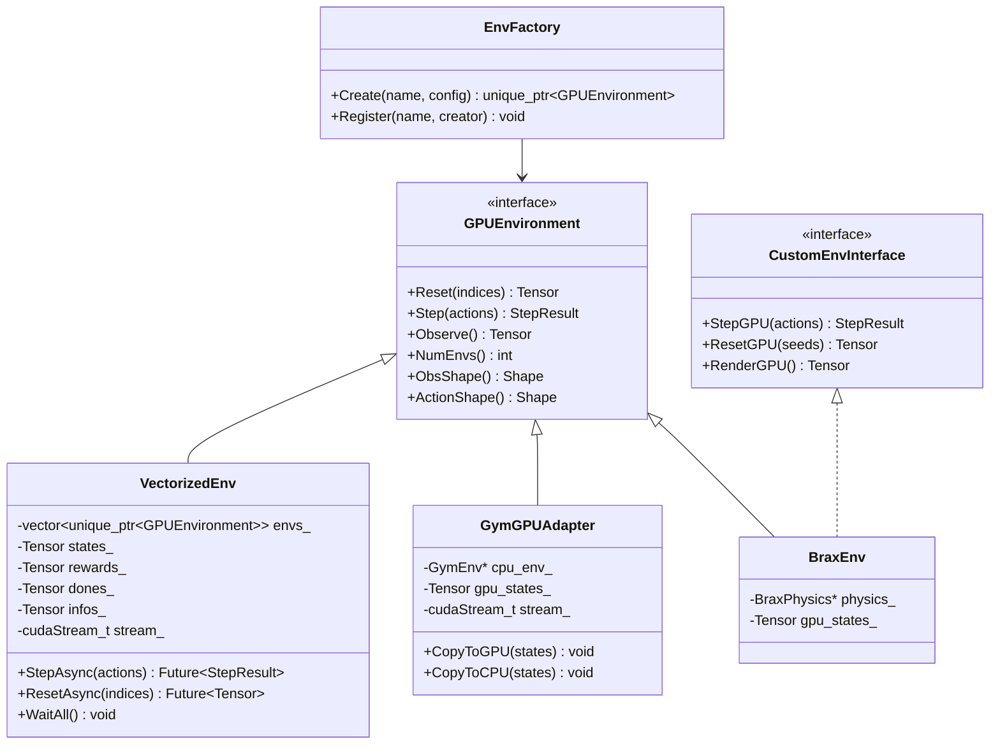

#### 3.2.3 核心数据结构

```cpp
// 批量环境步进结果
struct StepResult {
    Tensor next_states;     // [num_envs, *obs_shape]
    Tensor rewards;         // [num_envs]
    Tensor dones;           // [num_envs] (bool)
    Tensor truncated;       // [num_envs] (bool)
    Tensor infos;           // [num_envs] (JSON strings or structured)
};

// 环境配置
struct EnvConfig {
    std::string env_name;
    int num_envs = 4096;
    bool vectorized = true;
    int max_episode_steps = 1000;
    bool auto_reset = true;  // 自动重置 done 环境
    Shape obs_shape;
    Shape action_shape;
    std::string action_space;  // "discrete", "continuous", "multi_binary"
};

// 向量化环境管理器
class VectorizedEnvManager {
public:
    // 批量重置
    Status ResetBatch(const Tensor& env_indices, cudaStream_t stream = nullptr);

    // 异步步进
    std::future<StepResult> StepAsync(const Tensor& actions,
                                       cudaStream_t stream = nullptr);

    // 检查 done 环境并自动重置
    Status AutoReset(cudaStream_t stream = nullptr);

    // 获取所有活跃环境的状态
    Tensor GatherActiveStates(cudaStream_t stream = nullptr);

    // 性能统计
    EnvStats GetStats() const;

private:
    int num_envs_;
    Tensor states_;        // [num_envs, *obs_shape] on GPU
    Tensor episode_ids_;   // [num_envs]
    Tensor episode_steps_; // [num_envs]
    std::unique_ptr<GPUEnvironment> backend_;
    cudaStream_t stream_;
};
```

#### 3.2.4 CUDA Kernel 设计

```cuda
// 批量环境重置 Kernel
// 每个 warp 负责一个环境实例的重置
__global__ void ResetEnvsKernel(
    float* __restrict__ states,      // [num_envs, obs_dim]
    int* __restrict__ episode_ids,   // [num_envs]
    int* __restrict__ episode_steps,  // [num_envs]
    const int* __restrict__ indices,  // 需要重置的环境索引
    int num_resets,
    int obs_dim,
    curandState* __restrict__ rng_states  // 每个环境独立的 RNG
) {
    int idx = blockIdx.x * blockDim.x + threadIdx.x;
    if (idx >= num_resets) return;

    int env_id = indices[idx];

    // Warp-level 协作重置
    int lane_id = threadIdx.x % warpSize;
    int warp_id = threadIdx.x / warpSize;

    // 每个 warp 将一个环境的状态初始化为随机值
    for (int i = lane_id; i < obs_dim; i += warpSize) {
        curandState local_state = rng_states[env_id * warpSize + warp_id];
        states[env_id * obs_dim + i] = curand_uniform(&local_state) * 2.0f - 1.0f;
        rng_states[env_id * warpSize + warp_id] = local_state;
    }

    // 重置元数据
    if (lane_id == 0) {
        episode_ids[env_id] = atomicAdd(&global_episode_counter, 1);
        episode_steps[env_id] = 0;
    }
}

// 批量环境步进 Kernel（简单线性动力学示例）
__global__ void StepDynamicsKernel(
    const float* __restrict__ states,
    const float* __restrict__ actions,
    float* __restrict__ next_states,
    float* __restrict__ rewards,
    bool* __restrict__ dones,
    int num_envs,
    int obs_dim,
    int act_dim
) {
    int env_id = blockIdx.x * blockDim.x + threadIdx.x;
    if (env_id >= num_envs) return;

    // 读取当前状态和动作
    const float* state = states + env_id * obs_dim;
    const float* action = actions + env_id * act_dim;
    float* next_state = next_states + env_id * obs_dim;

    // 动力学计算（以简单 CartPole 为例）
    // 实际项目中会通过虚函数表分发到具体的环境动力学实现
    float x = state[0], x_dot = state[1];
    float theta = state[2], theta_dot = state[3];
    float force = action[0];

    // ... 物理计算 ...

    // 计算奖励
    rewards[env_id] = (fabs(theta) < 0.2f) ? 1.0f : 0.0f;

    // 检查终止条件
    dones[env_id] = (fabs(x) > 2.4f) || (fabs(theta) > 0.42f);
}
```

#### 3.2.5 Python API

```python
import turborl

# 创建 GPU 环境
env = turborl.make("CartPole-v1", num_envs=4096, device="cuda:0")

# 批量重置
states = env.reset()

# 批量步进
for _ in range(1000):
    actions = policy(states)  # 策略推理（也在 GPU 上）
    next_states, rewards, dones, infos = env.step(actions)
    # ... 训练逻辑 ...
    states = next_states

# 环境统计
stats = env.stats()
print(f"FPS: {stats.fps}, GPU Util: {stats.gpu_util:.1f}%")
```

#### 3.2.6 性能目标

| 指标                 | 目标值              | 对比基线                        |
| ------------------ | ---------------- | --------------------------- |
| 单 GPU 环境并发数        | 16,384           | Gym 单进程 ~100                |
| Step 吞吐 (CartPole) | > 10M steps/s    | Gym Vectorized ~50K steps/s |
| Step 吞吐 (Atari)    | > 1M steps/s     | EnvPool ~800K steps/s       |
| GPU 到 CPU 数据拷贝     | 0（完全 GPU-native） | 传统方案每步拷贝                    |

---

### 3.3 CUDA Replay Buffer

#### 3.3.1 职责

CUDA Replay Buffer 是 TurboRL 的核心数据管理组件，负责：

1. **GPU-native 经验存储**: 所有经验数据保存在 GPU 显存中
2. **高效采样**: 批量采样操作直接在 GPU 上完成，无需 CPU 参与
3. **优先级管理**: 支持 PER（Prioritized Experience Replay）数据结构
4. **多线程安全**: 支持单生产者多消费者并发访问
5. **环形缓冲区**: 基于 CUDA 的环形缓冲区实现，支持 O(1) 插入和高效采样

#### 3.3.2 类图

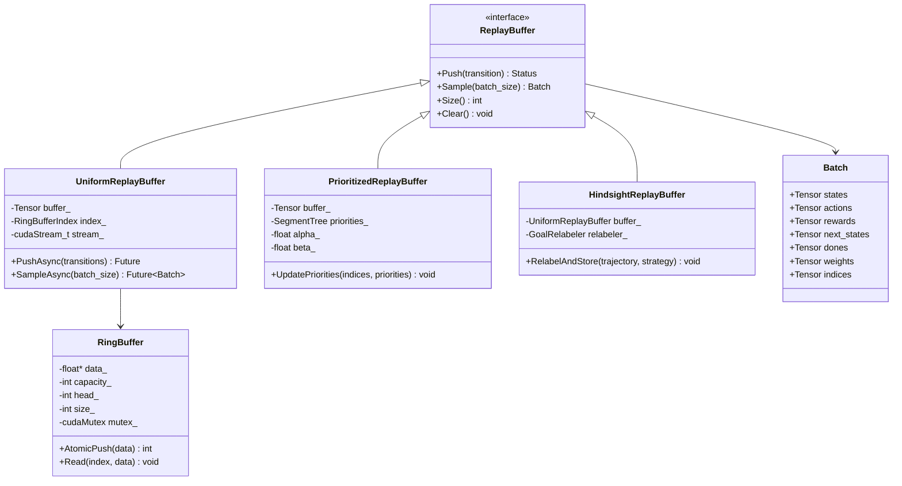

#### 3.3.3 核心数据结构

```cpp
// 经验转移（Transition）
struct Transition {
    // 所有数据存储在 GPU 上
    float* states;       // [batch, *obs_shape]
    float* actions;      // [batch, *act_shape]
    float* rewards;      // [batch]
    float* next_states;  // [batch, *obs_shape]
    bool* dones;         // [batch]
    float* extra;        // [batch, *extra_dim] 可选额外信息
};

// Ring Buffer 配置
struct ReplayBufferConfig {
    int capacity = 1'000'000;          // 最大容量
    int obs_dim = 128;
    int act_dim = 8;
    int extra_dim = 0;                 // 额外信息维度
    float alpha = 0.6;                 // PER alpha
    float beta = 0.4;                  // PER beta
    float beta_increment = 1e-6;       // beta 增量
    float epsilon = 1e-6;              // PER epsilon
    bool use_priority = false;
    int n_step = 1;                    // N-step returns
    float gamma = 0.99;                // 折扣因子
    std::string device = "cuda:0";
};

// GPU Ring Buffer 实现
template<typename T>
class GPURingBuffer {
public:
    GPURingBuffer(int capacity, cudaStream_t stream = nullptr);

    // 原子追加数据，返回写入位置
    __host__ __device__ int Push(const T* data, int count);

    // 批量读取
    void Read(int start, int count, T* out, cudaStream_t stream);

    // 随机采样（GPU kernel 内调用）
    __device__ void SampleRandom(
        int* indices, int batch_size,
        curandState* rng_state
    );

    __host__ int Size() const { return size_; }
    __host__ int Capacity() const { return capacity_; }

private:
    T* data_;           // GPU buffer
    int capacity_;
    int write_head_;    // 写指针（原子操作）
    int size_;          // 当前大小
    int* read_count_;   // 每个槽位的读取计数（用于安全覆盖）
};

// PER Segment Tree (GPU实现)
class GPUSegmentTree {
public:
    GPUSegmentTree(int capacity);

    // 构建/更新树
    void Build(const float* priorities, cudaStream_t stream);
    void Update(int index, float priority, cudaStream_t stream);

    // 按优先级采样（返回采样索引）
    void SamplePrioritized(
        int batch_size,
        int* out_indices,
        float* out_weights,
        cudaStream_t stream
    );

    float TotalSum() const;

private:
    float* tree_;      // GPU array, size = 2 * capacity
    int capacity_;
    int leaf_offset_;  // = capacity
};
```

#### 3.3.4 CUDA Kernel 设计

```cuda
// Ring Buffer 批量写入 Kernel
template<typename T, int BLOCK_SIZE = 256>
__global__ void RingBufferPushKernel(
    T* __restrict__ buffer,           // [capacity, elem_size]
    int* __restrict__ write_head,     // 原子写指针
    int* __restrict__ size,           // 原子计数器
    const T* __restrict__ data,       // [count, elem_size]
    int count,
    int capacity,
    int elem_size
) {
    int idx = blockIdx.x * blockDim.x + threadIdx.x;
    if (idx >= count) return;

    // 原子获取写入位置
    int write_pos;
    if (threadIdx.x == 0) {
        write_pos = atomicAdd(write_head, count);
    }
    write_pos = __shfl_sync(0xffffffff, write_pos, 0);

    // 计算环绕后的实际位置
    int actual_pos = (write_pos + idx) % capacity;

    // 写入数据
    for (int e = 0; e < elem_size; e++) {
        buffer[actual_pos * elem_size + e] = data[idx * elem_size + e];
    }

    // 同步并更新 size
    __threadfence();
    if (idx == 0) {
        atomicAdd(size, count);
        // Clamp to capacity
        int current_size = atomicMin(size, capacity);
        (void)current_size;
    }
}

// 均匀随机采样 Kernel
template<int BLOCK_SIZE = 256>
__global__ void UniformSampleKernel(
    float* __restrict__ states,         // [capacity, obs_dim]
    float* __restrict__ actions,        // [capacity, act_dim]
    float* __restrict__ rewards,        // [capacity]
    float* __restrict__ next_states,    // [capacity, obs_dim]
    bool* __restrict__ dones,           // [capacity]
    int* __restrict__ out_indices,      // [batch_size]
    float* __restrict__ out_states,     // [batch_size, obs_dim]
    float* __restrict__ out_actions,    // [batch_size, act_dim]
    float* __restrict__ out_rewards,    // [batch_size]
    float* __restrict__ out_next_states,// [batch_size, obs_dim]
    bool* __restrict__ out_dones,       // [batch_size]
    int buffer_size,                    // 当前有效大小
    int batch_size,
    int obs_dim,
    int act_dim,
    curandState* __restrict__ rng_states
) {
    int idx = blockIdx.x * blockDim.x + threadIdx.x;
    if (idx >= batch_size) return;

    curandState local_state = rng_states[idx];

    // 生成随机索引
    int src_idx = curand(&local_state) % buffer_size;

    rng_states[idx] = local_state;
    out_indices[idx] = src_idx;

    // 向量化拷贝（使用 float4 提升带宽利用率）
    #pragma unroll
    for (int i = 0; i < obs_dim; i += 4) {
        if (i + 3 < obs_dim) {
            float4 val = reinterpret_cast<float4*>(
                states + src_idx * obs_dim + i
            )[0];
            reinterpret_cast<float4*>(out_states + idx * obs_dim + i)[0] = val;
        }
    }

    // 拷贝 actions (同样使用向量化)
    #pragma unroll
    for (int i = 0; i < act_dim; i += 4) {
        if (i + 3 < act_dim) {
            float4 val = reinterpret_cast<float4*>(
                actions + src_idx * act_dim + i
            )[0];
            reinterpret_cast<float4*>(out_actions + idx * act_dim + i)[0] = val;
        }
    }

    // 拷贝标量数据
    out_rewards[idx] = rewards[src_idx];
    out_dones[idx] = dones[src_idx];

    // 拷贝 next_states（如果有）
    if (next_states != nullptr) {
        #pragma unroll
        for (int i = 0; i < obs_dim; i += 4) {
            if (i + 3 < obs_dim) {
                float4 val = reinterpret_cast<float4*>(
                    next_states + src_idx * obs_dim + i
                )[0];
                reinterpret_cast<float4*>(
                    out_next_states + idx * obs_dim + i
                )[0] = val;
            }
        }
    }
}

// PER Segment Tree 采样 Kernel
template<int BLOCK_SIZE = 256, int WARP_SIZE = 32>
__global__ void SegmentTreeSampleKernel(
    const float* __restrict__ tree,     // segment tree, size = 2 * capacity
    int* __restrict__ out_indices,      // [batch_size]
    float* __restrict__ out_weights,    // [batch_size]
    int batch_size,
    int capacity,
    int leaf_offset,
    float total_priority,
    float beta,
    curandState* __restrict__ rng_states
) {
    int idx = blockIdx.x * blockDim.x + threadIdx.x;
    if (idx >= batch_size) return;

    curandState local_state = rng_states[idx];

    // 采样均匀随机数
    float sample = curand_uniform(&local_state) * total_priority;
    rng_states[idx] = local_state;

    // 树中二分查找
    int node = 1;  // 根节点
    while (node < leaf_offset) {
        float left_val = tree[2 * node];
        if (sample <= left_val) {
            node = 2 * node;
        } else {
            sample -= left_val;
            node = 2 * node + 1;
        }
    }

    int leaf_idx = node - leaf_offset;
    out_indices[idx] = leaf_idx;

    // 计算重要性采样权重
    float prob = tree[node] / total_priority;
    float max_prob = 1.0f / (float)capacity;  // 简化计算
    // 更精确的 max_prob 需要单独的 reduction pass
    float weight = __powf(1.0f / (capacity * prob), beta);
    out_weights[idx] = weight;
}
```

#### 3.3.5 内存布局

```text
Uniform Replay Buffer 内存布局（GPU显存）:

┌──────────────────────────────────────────────────────────────────────┐
│ [states]       │ capacity × obs_dim  × sizeof(float)                 │
│ [actions]      │ capacity × act_dim  × sizeof(float)                 │
│ [rewards]      │ capacity × 1        × sizeof(float)                 │
│ [next_states]  │ capacity × obs_dim  × sizeof(float)                 │
│ [dones]        │ capacity × 1        × sizeof(bool)                  │
├──────────────────────────────────────────────────────────────────────┤
│ 总显存占用 = capacity × (2*obs_dim + act_dim + 1) × sizeof(float)    │
│            + capacity × sizeof(bool)                                  │
│                                                                       │
│ 示例: capacity=1M, obs_dim=128, act_dim=8                           │
│ = 1M × (256 + 8 + 1) × 4 + 1M × 1                                   │
│ = 1M × 265 × 4 + 1M                                                 │
│ ≈ 1.06 GB                                                            │
└──────────────────────────────────────────────────────────────────────┘

Prioritized Replay Buffer 额外内存:
┌──────────────────────────────────────────────────────────────────────┐
│ [priorities]   │ capacity × 1 × sizeof(float)                        │
│ [segment_tree] │ 2 × capacity × sizeof(float) — Segment Tree 结构     │
│ 额外占用 ≈ 3 × capacity × sizeof(float) ≈ 12 MB (capacity=1M)       │
└──────────────────────────────────────────────────────────────────────┘
```

#### 3.3.6 性能目标

| 指标                  | 目标值                  |
| ------------------- | -------------------- |
| Push 吞吐             | > 500K transitions/s |
| Sample 吞吐 (uniform) | > 5M transitions/s   |
| Sample 吞吐 (PER)     | > 2M transitions/s   |
| 端到端延迟 (push→sample) | < 100 μs             |
| 显存利用率               | > 95%（buffer 占用）     |

#### 3.3.7 测试方案

```cpp
// 单元测试覆盖
class ReplayBufferTest {
    // 1. 基础功能测试
    void TestPushAndSample();        // 基本读写
    void TestRingBufferWrap();      // 环形缓冲区环绕
    void TestCapacityLimit();       // 容量上限

    // 2. 正确性测试
    void TestDataIntegrity();       // 数据完整性
    void TestSamplingUniformity();  // 采样均匀性（卡方检验）
    void TestPERDistribution();     // PER 分布正确性

    // 3. 并发测试
    void TestConcurrentPushSample();// 并发读写
    void TestMultiStreamAccess();   // 多 CUDA Stream 访问

    // 4. 性能测试
    void BenchmarkPushThroughput(); // Push 吞吐
    void BenchmarkSampleThroughput();// Sample 吞吐
    void BenchmarkLatency();        // 端到端延迟

    // 5. 边界值测试
    void TestEmptyBuffer();
    void TestFullBuffer();
    void TestBatchSizeOne();
    void TestMaxBatchSize();
};
```

---

### 3.4 RLHF Rollout Engine

#### 3.4.1 职责

Rollout Engine 负责 RLHF 训练中的经验收集阶段，是连接 Policy 和 Environment 的桥梁。它：

1. **批量生成**: 管理大量并发生成请求
2. **KV Cache 管理**: 高效利用 GPU 显存进行推理
3. **异步流水线**: 将推理、环境交互、数据存储流水线化
4. **推理后端抽象**: 统一接口支持 vLLM、SGLang、TensorRT-LLM
5. **停止条件管理**: 支持 EOS token、最大长度、自定义停止条件

#### 3.4.2 类图

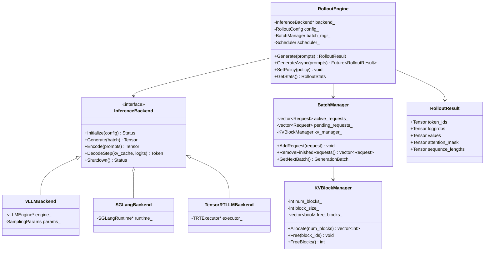

#### 3.4.3 核心数据结构

```cpp
// Rollout 配置
struct RolloutConfig {
    // 推理后端
    std::string inference_backend = "vllm";  // "vllm", "sglang", "tensorrt_llm"

    // 生成参数
    int max_new_tokens = 2048;
    int min_new_tokens = 1;
    float temperature = 1.0;
    float top_p = 1.0;
    int top_k = 50;
    float repetition_penalty = 1.0;
    std::vector<std::string> stop_strings;
    int eos_token_id = -1;

    // 批量管理
    int max_batch_size = 256;
    int max_num_seqs = 512;
    int max_num_batched_tokens = 32768;

    // KV Cache
    int gpu_memory_utilization = 90;  // 百分比
    int block_size = 16;              // KV cache block size
    bool enable_prefix_caching = true;

    // 异步流水线
    bool async_rollout = true;
    int prefetch_batches = 2;        // 预取 batch 数
};

// 生成请求
struct GenerationRequest {
    int request_id;
    std::vector<int> prompt_token_ids;
    SamplingParams sampling_params;
    int max_tokens;
    std::optional<std::vector<int>> stop_token_ids;
    double arrival_time;            // 用于 SLO 追踪
};

// 生成结果
struct GenerationOutput {
    int request_id;
    std::vector<int> token_ids;
    std::vector<float> logprobs;
    std::vector<float> values;       // 如果 Policy 是 Actor-Critic
    std::vector<float> attention_mask;
    int prompt_length;
    int total_length;
    FinishReason finish_reason;     // EOS, MAX_LENGTH, STOP_STRING, ABORTED
};

enum class FinishReason {
    EOS,
    MAX_LENGTH,
    STOP_STRING,
    ABORTED,
    ERROR
};
```

#### 3.4.4 异步流水线设计

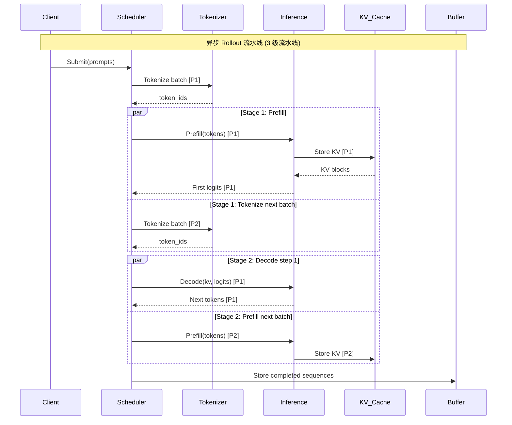

#### 3.4.5 与 PPO 训练的集成

```cpp
// PPO Rollout 循环
class PPORolloutRunner {
public:
    Status RunRollout(
        PolicyEngine* policy,
        RewardEngine* reward,
        ReplayBuffer* buffer,
        int num_rollout_steps
    ) {
        // 第 1 阶段: 生成 rollout
        for (int step = 0; step < num_rollout_steps; ++step) {
            // 获取当前 observation（来自环境或 prompt）
            auto observations = env_->Observe();

            // 策略推理：获取 actions + logprobs + values
            auto [actions, logprobs, values] = policy->Forward(observations);

            // 环境步进
            auto [next_states, rewards, dones] = env_->Step(actions);

            // 存储到 Replay Buffer（异步）
            buffer->PushAsync({
                .states = observations,
                .actions = actions,
                .rewards = rewards,
                .next_states = next_states,
                .dones = dones,
                .logprobs = logprobs,
                .values = values,
            });
        }

        // 第 2 阶段: 计算 GAE 和 Returns
        ComputeGAEAndReturns(buffer);

        return Status::OK;
    }

private:
    void ComputeGAEAndReturns(ReplayBuffer* buffer) {
        // 在 GPU 上批量计算 GAE (Generalized Advantage Estimation)
        // 使用专门优化的 CUDA kernel
        ComputeGAEKernel<<<grid, block, 0, stream>>>(
            buffer->rewards(),
            buffer->values(),
            buffer->dones(),
            gamma_, lambda_,
            buffer->advantages(),
            buffer->returns(),
            buffer->size()
        );
    }
};
```

#### 3.4.6 性能目标

| 推理后端         | 目标吞吐 (Llama-7B)   | 目标延迟 (TTFT) |
| ------------ | ----------------- | ----------- |
| vLLM         | > 5K tokens/s/GPU | < 100ms     |
| SGLang       | > 6K tokens/s/GPU | < 80ms      |
| TensorRT-LLM | > 8K tokens/s/GPU | < 50ms      |

---

### 3.5 Reward Engine

#### 3.5.1 职责

Reward Engine 负责 RLHF 训练中的奖励计算，支持：

1. **多模型奖励组合**: 组合多个 Reward Model 的输出
2. **规则奖励**: 支持基于规则的奖励函数（格式、长度、关键词等）
3. **KL 惩罚**: 计算与参考策略的 KL 散度作为惩罚项
4. **PPO/DPO/GRPO 奖励**: 不同算法特定的奖励计算
5. **奖励归一化**: 批次内/运行中的奖励归一化

#### 3.5.2 类图

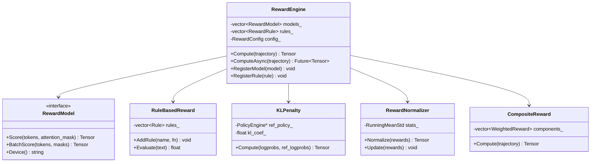

#### 3.5.3 核心数据结构

```cpp
// 奖励配置
struct RewardConfig {
    // 组合权重
    std::vector<float> model_weights;      // 每个 RM 的权重
    float rule_weight = 0.1;              // 规则奖励权重
    float kl_penalty_weight = 0.01;       // KL 惩罚权重

    // KL 惩罚
    float kl_target = 0.1;                // 目标 KL 散度
    bool adaptive_kl = true;              // 自适应调整 KL 系数
    float kl_adapt_rate = 0.01;           // KL 自适应速率

    // 归一化
    bool normalize_rewards = true;
    float reward_clip = 10.0;             // 奖励裁剪
    float gamma = 1.0;                    // 折扣因子

    // 规则奖励
    struct RuleReward {
        std::string name;
        std::string type;                 // "length", "format", "keyword", "custom"
        float weight;
        json params;
    };
    std::vector<RuleReward> rules;
};

// 奖励计算结果
struct RewardOutput {
    Tensor total_rewards;       // [batch_size] 总奖励
    Tensor model_rewards;       // [num_models, batch_size] 各个 RM 的分数
    Tensor rule_rewards;        // [num_rules, batch_size] 各个规则的分数
    Tensor kl_penalties;        // [batch_size] KL 惩罚
    Tensor scores;              // [batch_size] 原始分数（归一化前）
};

// KL Penalty CUDA Kernel
__global__ void ComputeKLPenaltyKernel(
    const float* __restrict__ logprobs,        // [batch, seq_len]
    const float* __restrict__ ref_logprobs,    // [batch, seq_len]
    const float* __restrict__ attention_mask,  // [batch, seq_len]
    float* __restrict__ kl_penalties,          // [batch]
    int batch_size,
    int seq_len
) {
    int batch_idx = blockIdx.x;
    if (batch_idx >= batch_size) return;

    // Warp-level reduction for KL computation
    float kl_sum = 0.0f;
    float valid_tokens = 0.0f;

    for (int i = threadIdx.x; i < seq_len; i += blockDim.x) {
        if (attention_mask[batch_idx * seq_len + i] > 0.5f) {
            float log_ratio = logprobs[batch_idx * seq_len + i]
                            - ref_logprobs[batch_idx * seq_len + i];
            // KL(p||ref) = E_p[log(p/ref)] = E_p[log_p - log_ref]
            // 使用经验 KL: log_p - log_ref (在 p 下采样)
            kl_sum += log_ratio;
            valid_tokens += 1.0f;
        }
    }

    // Warp reduce
    for (int offset = warpSize / 2; offset > 0; offset /= 2) {
        kl_sum += __shfl_down_sync(0xffffffff, kl_sum, offset);
        valid_tokens += __shfl_down_sync(0xffffffff, valid_tokens, offset);
    }

    if (threadIdx.x % warpSize == 0) {
        // 平均每个 token 的 KL
        float kl = (valid_tokens > 0) ? (kl_sum / valid_tokens) : 0.0f;
        // 负 KL 作为惩罚（目标是最小化 KL）
        kl_penalties[batch_idx] = -kl;
    }
}
```

#### 3.5.4 奖励计算流程

```text
RLHF 奖励计算流程:

1. [推理] 传入生成的 response token_ids
   └─> Reward Model(s) 打分
       ├─> RM1 (Helpfulness): score_1 ∈ [-5, 5]
       ├─> RM2 (Safety):      score_2 ∈ [-5, 5]
       └─> RM3 (Honesty):     score_3 ∈ [-5, 5]

2. [规则] 基于规则计算
   ├─> 格式奖励: +0.1 如果格式正确
   ├─> 长度奖励: -0.01 * (len - target_len)^2
   └─> 关键词奖励: +0.05 每个目标关键词

3. [KL 惩罚] 计算与参考策略的 KL 散度
   └─> kl_penalty = -kl_coef * KL(π_current || π_ref)

4. [组合] 加权求和
   └─> total_reward = Σ(w_i * score_i) + Σ(rule_rewards) + kl_penalty

5. [归一化] 批次内归一化（可选）
   └─> reward_norm = (reward - μ_batch) / (σ_batch + ε)
```

---

### 3.6 Policy Engine

#### 3.6.1 职责

Policy Engine 负责策略的推理、更新和管理：

1. **策略推理**: 前向传播获取 action/logprobs/values
2. **策略更新**: PPO/DPO/GRPO 等算法的参数更新
3. **多策略管理**: 同时管理 Actor、Critic、Reference Policy、Reward Model
4. **优化器集成**: 与 AdamW、SGD 等优化器集成，支持混合精度训练
5. **LoRA/QLoRA**: 支持参数高效微调

#### 3.6.2 类图

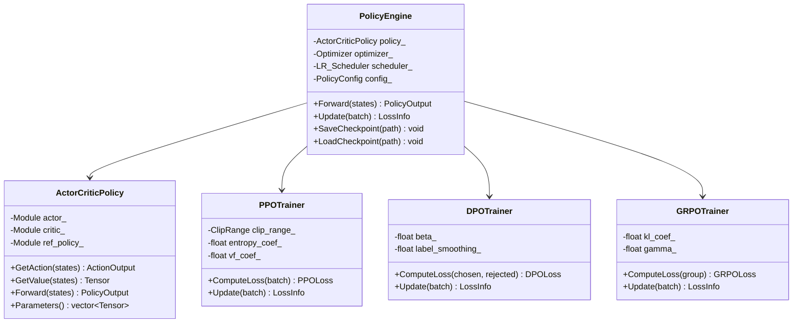

#### 3.6.3 核心数据结构

```cpp
// PPO 配置
struct PPOConfig {
    // 裁剪参数
    float clip_epsilon = 0.2;
    float value_clip_epsilon = 0.2;

    // 损失系数
    float policy_loss_coef = 1.0;
    float value_loss_coef = 0.5;
    float entropy_coef = 0.01;

    // KL 散度
    float target_kl = 0.01;
    bool early_stop_on_kl = false;

    // 更新参数
    int ppo_epochs = 4;
    int num_minibatches = 4;
    bool shuffle_minibatches = true;

    // GAE 参数
    float gamma = 0.99;
    float gae_lambda = 0.95;

    // 混合精度
    bool use_amp = true;        // Automatic Mixed Precision
    bool use_bfloat16 = false;

    // 优化器
    float learning_rate = 1e-4;
    float adam_beta1 = 0.9;
    float adam_beta2 = 0.999;
    float adam_epsilon = 1e-8;
    float weight_decay = 0.01;
    float max_grad_norm = 0.5;

    // LR 调度
    bool use_lr_scheduler = true;
    int warmup_steps = 100;
    std::string lr_schedule = "cosine"; // "linear", "cosine", "constant"
};

// PPO 损失计算
struct PPOLossOutput {
    float policy_loss;
    float value_loss;
    float entropy_loss;
    float total_loss;
    float approx_kl;
    float clip_frac;       // 被裁剪的 ratio 比例（监控指标）
    float explained_var;   // Value function 解释方差
};
```

#### 3.6.4 PPO 更新 CUDA Kernel

```cuda
// PPO Policy Loss Kernel
// 计算 clipped surrogate objective
__global__ void PPOPolicyLossKernel(
    const float* __restrict__ logprobs,       // [batch] 新策略的 log prob
    const float* __restrict__ old_logprobs,   // [batch] 旧策略的 log prob
    const float* __restrict__ advantages,     // [batch] GAE advantages
    const float* __restrict__ action_mask,    // [batch] 有效 token 掩码
    float* __restrict__ out_loss,             // [num_blocks] 部分损失（之后 reduce）
    float* __restrict__ out_kl,               // [num_blocks] 部分 KL
    float* __restrict__ out_clip_frac,        // [num_blocks] 裁剪比例
    int batch_size,
    float clip_epsilon
) {
    extern __shared__ float sdata[];  // 共享内存 reduce buffer

    int tid = threadIdx.x;
    int idx = blockIdx.x * blockDim.x + tid;

    float loss_sum = 0.0f;
    float kl_sum = 0.0f;
    float clip_count = 0.0f;
    float valid_count = 0.0f;

    if (idx < batch_size) {
        // 计算 probability ratio
        float log_ratio = logprobs[idx] - old_logprobs[idx];
        float ratio = expf(log_ratio);

        // Clipped surrogate objective
        float surr1 = ratio * advantages[idx];
        float surr2 = fminf(fmaxf(ratio, 1.0f - clip_epsilon),
                           1.0f + clip_epsilon) * advantages[idx];

        // 取最小值（当 advantage 为正时 clip ratio 过大，为负时 clip ratio 过小）
        float policy_loss = -fminf(surr1, surr2);

        // 统计指标
        float approx_kl = -log_ratio;  // 近似 KL = -E[log_ratio]
        bool is_clipped = fabsf(ratio - 1.0f) > clip_epsilon;

        loss_sum = policy_loss * action_mask[idx];
        kl_sum = approx_kl * action_mask[idx];
        clip_count = is_clipped ? action_mask[idx] : 0.0f;
        valid_count = action_mask[idx];
    }

    // Block-level reduction
    sdata[tid] = loss_sum;
    __syncthreads();
    for (int s = blockDim.x / 2; s > 0; s >>= 1) {
        if (tid < s) sdata[tid] += sdata[tid + s];
        __syncthreads();
    }

    if (tid == 0) {
        out_loss[blockIdx.x] = sdata[0];
        out_kl[blockIdx.x] = kl_sum;    // 还需要 reduce
        out_clip_frac[blockIdx.x] = clip_count;
    }
}

// GAE (Generalized Advantage Estimation) Kernel
// 反向计算 GAE 和 Returns
__global__ void GAEKernel(
    const float* __restrict__ rewards,       // [T]
    const float* __restrict__ values,        // [T+1] 包含 bootstrap_value
    const bool* __restrict__ dones,          // [T]
    float* __restrict__ advantages,          // [T]
    float* __restrict__ returns,             // [T]
    int T,
    float gamma,
    float lambda
) {
    // 单线程反向计算（GAE 是顺序依赖的）
    // 对于大批量数据，每个 trajectory 分配一个线程
    int traj_id = blockIdx.x;
    int traj_start = traj_id * T;
    int traj_offset = blockIdx.y * blockDim.x + threadIdx.x;

    if (traj_offset > 0) return;  // 每个 trajectory 只需一个线程

    float gae = 0.0f;
    for (int t = T - 1; t >= 0; t--) {
        int idx = traj_start + t;
        float mask = dones[idx] ? 0.0f : 1.0f;

        float delta = rewards[idx]
                    + gamma * values[idx + 1] * mask
                    - values[idx];

        gae = delta + gamma * lambda * mask * gae;
        advantages[idx] = gae;
        returns[idx] = gae + values[idx];
    }
}
```

#### 3.6.5 混合精度训练

```cpp
class MixedPrecisionPolicyUpdate {
public:
    Status UpdateWithAMP(const Batch& batch) {
        // 使用 PyTorch autocast 或手动 fp16/bf16 管理
        #ifdef TURBORL_USE_CUDA
        // 将模型参数转换为 fp16
        // 前向传播在 fp16 中进行
        // 反向传播在 fp16 中进行
        // 梯度缩放防止下溢
        // 优化器 step 前将梯度转回 fp32
        #endif

        // 梯度缩放器
        float loss_scale = 65536.0f;  // 初始缩放因子
        const float scale_factor = 2.0f;
        const float scale_window = 2000;

        for (int epoch = 0; epoch < ppo_epochs_; epoch++) {
            auto output = ForwardFP16(batch);
            auto loss = ComputeLoss(output, batch);

            // 缩放损失并反向传播
            loss.total_loss *= loss_scale;
            BackwardFP16(loss.total_loss);

            // 检查梯度中的 Inf/NaN
            bool has_overflow = CheckGradientOverflow();

            if (!has_overflow) {
                // Unscale gradients and step
                UnscaleGradients(loss_scale);
                ClipGradients();
                optimizer_.Step();

                // 增加缩放因子
                if (iteration_ % scale_window == 0) {
                    loss_scale *= scale_factor;
                }
            } else {
                // 跳过此步并减小缩放因子
                loss_scale /= scale_factor;
            }
        }
        return Status::OK;
    }
};
```

---

### 3.7 Distributed Engine

#### 3.7.1 职责

Distributed Engine 负责多 GPU 和多节点的分布式训练协调：

1. **通信原语**: AllReduce, AllGather, ReduceScatter, Broadcast 等
2. **并行策略**: Data Parallel, Tensor Parallel, Pipeline Parallel, Sequence Parallel
3. **参数同步**: 高效的梯度/参数同步机制
4. **故障恢复**: 节点故障检测、Checkpoint 恢复、动态扩缩容
5. **通信优化**: Gradient Bucketing, Communication-Computation Overlap, Gradient Compression

#### 3.7.2 类图

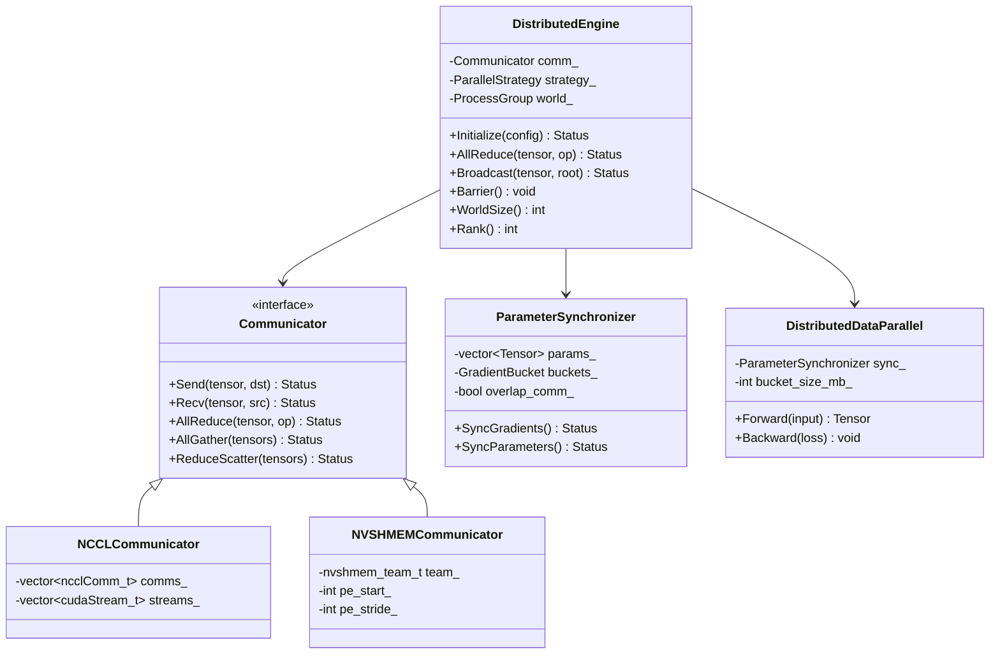

#### 3.7.3 核心数据结构

```cpp
// 分布式配置
struct DistributedConfig {
    // 基本设置
    int world_size = 1;
    int rank = 0;
    int local_rank = 0;
    std::string master_addr = "127.0.0.1";
    int master_port = 29500;

    // 通信后端
    std::string backend = "nccl";  // "nccl", "nvshmem", "mpi"

    // 并行策略
    enum ParallelMode {
        DATA_PARALLEL = 0,
        TENSOR_PARALLEL = 1,
        PIPELINE_PARALLEL = 2,
        SEQUENCE_PARALLEL = 3,
        ZERO_STAGE_1 = 4,
        ZERO_STAGE_2 = 5,
        ZERO_STAGE_3 = 6,
    };
    ParallelMode parallel_mode = DATA_PARALLEL;

    // Tensor Parallel 配置
    int tensor_parallel_size = 1;     // TP 组大小
    int pipeline_parallel_size = 1;   // PP 组大小

    // NCCL 配置
    int nccl_nchannels = 32;          // NCCL 通道数
    bool nccl_direct_gpu = true;      // GPU Direct RDMA

    // 梯度同步
    bool overlap_comm_compute = true; // 通信计算重叠
    int gradient_bucket_size_mb = 64; // 梯度桶大小 (MB)
    bool use_gradient_compression = false;
    float compression_ratio = 0.01;   // 压缩比 (Top-K)

    // 容错
    bool enable_fault_tolerance = false;
    int heartbeat_interval_sec = 30;
    int max_restart_attempts = 3;
};

// 进程组
class ProcessGroup {
public:
    ProcessGroup(int rank, int world_size, ncclUniqueId nccl_id);

    // 通信操作
    Status AllReduce(Tensor& tensor, ReduceOp op = ReduceOp::SUM);
    Status AllGather(std::vector<Tensor>& output, const Tensor& input);
    Status ReduceScatter(Tensor& output, const std::vector<Tensor>& input);
    Status Broadcast(Tensor& tensor, int root = 0);
    Status Send(const Tensor& tensor, int dst);
    Status Recv(Tensor& tensor, int src);

    // 同步
    Status Barrier();

    // 创建子组（用于 TP/PP）
    std::shared_ptr<ProcessGroup> CreateSubgroup(
        const std::vector<int>& ranks
    );

private:
    ncclComm_t comm_;
    int rank_;
    int world_size_;
    cudaStream_t comm_stream_;
};

// 梯度桶管理
class GradientBucket {
public:
    GradientBucket(int size_mb);

    // 注册需要同步的参数
    void RegisterParameter(Tensor param);

    // 标记参数就绪（当梯度计算完成时调用）
    void MarkReady(Tensor param);

    // 检查桶是否已满
    bool IsFull() const;

    // 触发 all-reduce
    Status Flush(ProcessGroup& pg, cudaStream_t stream);

private:
    struct BucketEntry {
        Tensor param;
        Tensor grad;
        bool ready = false;
        int bucket_id;
    };

    std::vector<BucketEntry> entries_;
    int current_size_bytes_ = 0;
    int max_size_bytes_;
    cudaEvent_t ready_event_;
};
```

#### 3.7.4 通信计算重叠

```cpp
// 带通信计算重叠的 DDP 训练步骤
class OverlappedDDP {
public:
    Status TrainingStep(const Batch& batch) {
        // 1. 前向传播（异步）
        auto output = model_->Forward(batch);

        // 2. 反向传播 + 重叠梯度同步
        //    当每个梯度桶准备就绪时，立即触发异步 all-reduce
        model_->BackwardWithOverlap(
            output.loss,
            [this](int bucket_id) {
                // 回调：桶准备就绪，启动异步通信
                auto& bucket = buckets_[bucket_id];
                bucket.FlushAsync(world_comm_, compute_stream_);
            }
        );

        // 3. 等待所有通信完成
        for (auto& bucket : buckets_) {
            bucket.WaitComplete();
        }

        // 4. 优化器步进
        optimizer_->Step();

        return Status::OK;
    }
};
```

#### 3.7.5 并行策略总览

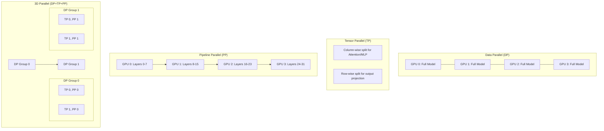

---

### 3.8 Dataset Module

#### 3.8.1 职责

Dataset Module 负责 RLHF 训练数据的加载、预处理和迭代：

1. **多格式支持**: HDF5, Lance, Parquet, JSONL, Arrow
2. **流式加载**: 支持内存无法容纳的超大数据集
3. **高效预处理**: GPU 加速的 Tokenization 和格式化
4. **数据混合**: 按比例混合多个数据源
5. **离线 RL 支持**: 加载预先收集的 transition 数据

#### 3.8.2 类图

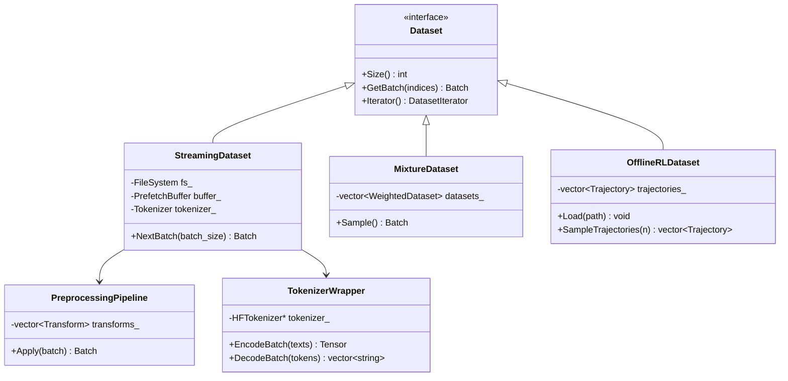

#### 3.8.3 核心数据结构

```cpp
// 数据集配置
struct DatasetConfig {
    std::string format = "jsonl";        // "hdf5", "lance", "parquet", "jsonl"
    std::vector<std::string> data_paths; // 数据文件路径
    int max_seq_length = 2048;
    int prefetch_size = 1000;            // 预取 batch 数
    int num_workers = 4;                 // 数据加载线程数
    bool shuffle = true;
    int shuffle_buffer_size = 10000;
    std::string tokenizer_path;
    float validation_split = 0.02;

    // 混合数据集
    struct MixEntry {
        std::string name;
        float weight;
        std::vector<std::string> paths;
    };
    std::vector<MixEntry> mix;
};

// 数据 Sample
struct DataSample {
    std::string prompt;
    std::string chosen;      // RLHF: 偏好回答
    std::string rejected;    // RLHF: 非偏好回答
    float reward;            // 可选预计算奖励
    json metadata;
};

// 预处理后的 Batch
struct PreprocessedBatch {
    Tensor input_ids;           // [batch, seq_len]
    Tensor attention_mask;      // [batch, seq_len]
    Tensor position_ids;        // [batch, seq_len]
    Tensor labels;              // [batch, seq_len] (for SFT)
    Tensor reward;              // [batch] 预计算奖励 (可选)
};
```

#### 3.8.4 数据加载流水线

```text
数据加载流水线（多线程异步）:

┌─────────────┐    ┌──────────────┐    ┌───────────────┐    ┌──────────┐
│ File Reader │───>│ Tokenizer    │───>│ Formatter     │───>│ Prefetch │
│ (I/O线程)    │    │ (CPU 线程池)  │    │ (组合 prompt)  │    │ Buffer   │
└─────────────┘    └──────────────┘    └───────────────┘    └──────────┘
                                                                │
                                                    ┌───────────┘
                                                    ▼
                                              ┌──────────┐
                                              │ GPU Batch │
                                              │ (训练用)    │
                                              └──────────┘

性能目标:
- Tokenization 吞吐: > 1M tokens/s/CPU core
- 端到端数据加载延迟: < 训练 step 时间的 10%
- 预取 Buffer 命中率: > 99%
```

---

### 3.9 Profiler Module

#### 3.9.1 职责

Profiler Module 提供全链路的性能分析和优化指导：

1. **CUDA 分析**: Kernel 执行时间、内存带宽、Occupancy
2. **通信分析**: NCCL 操作耗时、通信带宽利用率
3. **显存分析**: 显存使用追踪、碎片分析、泄漏检测
4. **端到端延迟**: 训练步骤各阶段的时间分布
5. **导出与可视化**: Chrome Trace, TensorBoard, Prometheus

#### 3.9.2 类图

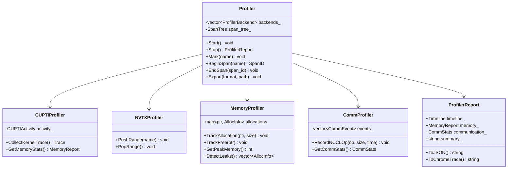

#### 3.9.3 核心数据结构

```cpp
// Profiler 配置
struct ProfilerConfig {
    bool enable_cupti = false;       // CUDA kernel trace (有开销)
    bool enable_nvtx = true;         // NVTX 标记 (低开销)
    bool enable_memory = true;       // 显存追踪
    bool enable_communication = true;// 通信追踪
    bool enable_python = true;       // Python 层追踪

    int trace_buffer_size_mb = 256;  // CUPTI trace buffer
    int sample_interval_ms = 100;    // 显存采样间隔
    std::string export_dir = "/tmp/turborl_traces";

    // 自动触发
    int profile_every_n_steps = 100; // 每 N 步自动 profile
    int profile_duration_steps = 10; // profile 持续步数
};

// Span 树 (用于构建调用层次)
class SpanTree {
public:
    struct Span {
        uint64_t id;
        uint64_t parent_id;
        std::string name;
        std::string category;        // "compute", "communication", "io", ...
        uint64_t start_ns;
        uint64_t end_ns;
        int device_id;
        int stream_id;
        std::map<std::string, std::string> metadata;
    };

    SpanID BeginSpan(const std::string& name);
    void EndSpan(SpanID id);
    std::vector<Span> Flatten() const;
};

// 分析报告
struct ProfilerReport {
    // 时间线
    struct TimelineEvent {
        std::string name;
        std::string category;
        uint64_t start_us;
        uint64_t duration_us;
        int device_id;
    };
    std::vector<TimelineEvent> timeline;

    // 显存
    struct MemoryReport {
        int64_t peak_allocated_mb;
        int64_t peak_reserved_mb;
        int64_t current_allocated_mb;
        std::vector<int64_t> history_mb;  // 时间序列
        std::vector<std::string> top_allocations;  // 最大的分配
        bool has_leak;
        std::vector<std::string> leak_candidates;
    };
    MemoryReport memory;

    // 通信
    struct CommStats {
        int64_t total_bytes_sent;
        int64_t total_bytes_recv;
        double avg_bandwidth_gbps;
        double peak_bandwidth_gbps;
        double comm_time_pct;  // 通信时间占比
        struct PerOp {
            std::string op;     // "AllReduce", "AllGather", etc.
            int count;
            int64_t total_bytes;
            double avg_time_us;
        };
        std::vector<PerOp> per_op_stats;
    };
    CommStats communication;

    // 计算
    struct ComputeStats {
        double total_compute_time_ms;
        double avg_step_time_ms;
        double std_step_time_ms;
        double throughput_samples_per_sec;
        double model_flops_utilization;  // MFU
    };
    ComputeStats compute;
};
```

#### 3.9.4 TensorBoard 集成

```cpp
class TensorBoardWriter {
public:
    TensorBoardWriter(const std::string& log_dir);

    void AddScalar(const std::string& tag, float value, int step);
    void AddHistogram(const std::string& tag, const std::vector<float>& values, int step);
    void AddImage(const std::string& tag, const Tensor& image, int step);
    void AddText(const std::string& tag, const std::string& text, int step);
    void AddGraph(const ModelGraph& graph);
    void Flush();

private:
    std::string log_dir_;
    EventFileWriter writer_;
};
```

---

### 3.10 Benchmark Module

Benchmark 设计详见 [第 9 节](#9-benchmark-设计)。

---

### 3.11 Python API Layer

#### 3.11.1 绑定架构

```text
Python API 架构:

┌─────────────────────────────────────────────────────────────────┐
│                    Python User Code                              │
│  import turborl                                                 │
│  env = turborl.make("CartPole-v1", num_envs=4096)              │
│  buffer = turborl.ReplayBuffer(capacity=1_000_000)             │
└─────────────────────────────────────────────────────────────────┘
                              │
                              ▼
┌─────────────────────────────────────────────────────────────────┐
│              pybind11 Bindings (include/turborl/python/)         │
│  PYBIND11_MODULE(turborl, m) {                                   │
│      py::class_<GPUEnvironment>(m, "GPUEnvironment")             │
│          .def("step", &GPUEnvironment::Step)                     │
│          .def("reset", &GPUEnvironment::Reset);                  │
│  }                                                               │
└─────────────────────────────────────────────────────────────────┘
                              │
                              ▼
┌─────────────────────────────────────────────────────────────────┐
│              Torch Extension (python/turborl/_torch_ext.cpp)     │
│  TORCH_LIBRARY(turborl, m) {                                     │
│      m.def("step_envs", &StepEnvs);                              │
│      m.def("sample_batch", &SampleBatch);                        │
│      m.def("compute_gae", &ComputeGAE);                          │
│  }                                                               │
└─────────────────────────────────────────────────────────────────┘
                              │
                              ▼
┌─────────────────────────────────────────────────────────────────┐
│              C++17 Core Engine (src/)                             │
└─────────────────────────────────────────────────────────────────┘
```

#### 3.11.2 Python API 清单

```python
# ============================================================
# turborl/__init__.py — 顶层 API
# ============================================================

# --- 环境 ---
turborl.make(env_name, **kwargs) -> GPUEnvironment
turborl.register_env(name, factory_fn)

# --- Replay Buffer ---
turborl.ReplayBuffer(capacity, obs_dim, act_dim, **kwargs)
turborl.PrioritizedReplayBuffer(capacity, alpha=0.6, beta=0.4)

# --- Rollout ---
turborl.RolloutEngine(model, config) -> RolloutEngine
turborl.InferenceBackend.create("vllm", config)
turborl.InferenceBackend.create("sglang", config)
turborl.InferenceBackend.create("tensorrt_llm", config)

# --- Reward ---
turborl.RewardEngine(config)
turborl.RewardModel.from_pretrained(path)
turborl.RuleReward(rules)

# --- Policy ---
turborl.PPOEngine(config)
turborl.DPOEngine(config)
turborl.GRPOEngine(config)

# --- Distributed ---
turborl.init_distributed(backend="nccl")
turborl.DistributedTrainer(config)

# --- Dataset ---
turborl.RLHFDataset(paths, tokenizer, config)
turborl.OfflineRLDataset(path)

# --- Profiler ---
turborl.Profiler(config)
turborl.profiler()  # 全局 profiler 实例

# --- Utility ---
turborl.set_device(device_id)
turborl.get_device_count() -> int
turborl.get_version() -> str
turborl.get_build_info() -> dict
```

---

## 4. CUDA Kernel 设计

### 4.1 Kernel 体系架构

```text
TurboRL CUDA Kernel 分类:

┌──────────────────────────────────────────────────────────────────┐
│                    CUDA Kernel 体系                               │
├──────────────────────────────────────────────────────────────────┤
│                                                                   │
│  ┌─────────────────┐  ┌─────────────────┐  ┌──────────────────┐ │
│  │ Environment Ops  │  │ Replay Buffer   │  │ Policy/Reward    │ │
│  │                  │  │                 │  │                  │ │
│  │ • ResetEnvs      │  │ • PushBatch     │  │ • GAECompute     │ │
│  │ • StepDynamics   │  │ • UniformSample │  │ • PPOLoss        │ │
│  │ • RenderStates   │  │ • PERSample     │  │ • DPOLoss        │ │
│  │ • ComputeReward  │  │ • UpdatePriority│  │ • KLPenalty      │ │
│  │ • TermCheck      │  │ • NStepReturn   │  │ • AdvantageNorm  │ │
│  └─────────────────┘  └─────────────────┘  └──────────────────┘ │
│                                                                   │
│  ┌─────────────────┐  ┌─────────────────┐  ┌──────────────────┐ │
│  │ Tensor Operators │  │ Memory Ops      │  │ Communication    │ │
│  │                  │  │                 │  │                  │ │
│  │ • BatchMatMul    │  │ • Allocate      │  │ • QuantizeGrad   │ │
│  │ • LayerNorm      │  │ • Deallocate    │  │ • DequantizeGrad │ │
│  │ • Softmax        │  │ • CopyAsync     │  │ • PackBits       │ │
│  │ • GELU/SwiGLU   │  │ • ZeroFill      │  │ • TopKGather     │ │
│  │ • Embedding      │  │ • Prefetch      │  │ • Sparsify       │ │
│  └─────────────────┘  └─────────────────┘  └──────────────────┘ │
│                                                                   │
└──────────────────────────────────────────────────────────────────┘
```

### 4.2 Kernel 设计规范

所有 CUDA Kernel 必须遵循以下设计规范：

```text
1. Naming Convention: <Module>_<Operation>_<DataType>_<Variant>Kernel
   示例: RB_UniformSample_FP32_VectorizedKernel

2. Launch Configuration:
   - block_size: 256 (默认), 根据 SM 占用率调优
   - grid_size: ceil(num_elements / block_size)
   - shared_memory: 显式声明，避免动态分配
   - max_registers: 64 (平衡占用率和寄存器溢出)

3. Memory Access Patterns:
   - 优先使用 float4 / uint4 向量化加载（128-bit）
   - Global memory 访问对齐到 128B cache line
   - Shared memory bank conflict 最小化（padding if needed）
   - 使用 __ldg() 读取只读数据

4. Error Handling:
   - 所有 kernel 调用后检查 cudaGetLastError()
   - 异步 kernel 使用 cudaStreamSynchronize() 检查
   - 生产环境使用 TURBORL_CUDA_CHECK 宏

5. Performance Requirements:
   - 内存带宽利用率 > 80%（A100/SM80+）
   - L1 cache hit rate > 60%（可缓存数据）
   - Occupancy > 50%
   - 单 kernel 延迟 < 100μs（除大型 matmul）
```

### 4.3 核心 Kernel 详细设计

#### 4.3.1 批量 LayerNorm Kernel

```cuda
// 高效批量 LayerNorm Kernel
// 支持 [batch_size, hidden_dim] 输入
// 使用 Welford 算法进行数值稳定的方差计算
template<int HIDDEN_DIM, int BLOCK_SIZE, int WARP_SIZE = 32>
__global__ void BatchLayerNormKernel(
    const float* __restrict__ input,    // [batch, hidden_dim]
    const float* __restrict__ gamma,    // [hidden_dim]
    const float* __restrict__ beta,     // [hidden_dim]
    float* __restrict__ output,         // [batch, hidden_dim]
    float* __restrict__ saved_mean,     // [batch] (可选)
    float* __restrict__ saved_var,      // [batch] (可选)
    int batch_size,
    float epsilon
) {
    extern __shared__ float shared[];
    float* s_mean = shared;
    float* s_var = shared + blockDim.x;

    int batch_idx = blockIdx.x;
    int tid = threadIdx.x;

    // Step 1: Welford 在线均值/方差计算
    float mean = 0.0f;
    float var = 0.0f;
    int count = 0;

    for (int i = tid; i < HIDDEN_DIM; i += blockDim.x) {
        float x = input[batch_idx * HIDDEN_DIM + i];
        count++;
        float delta = x - mean;
        mean += delta / count;
        float delta2 = x - mean;
        var += delta * delta2;
    }

    // Warp-level reduce
    for (int offset = warpSize / 2; offset > 0; offset /= 2) {
        float other_mean = __shfl_down_sync(0xffffffff, mean, offset);
        float other_var = __shfl_down_sync(0xffffffff, var, offset);
        int other_count = count;
        // Merge two Welford states
        float delta = other_mean - mean;
        float total_count = count + (float)other_count;
        var = var + other_var + delta * delta * (count * other_count) / total_count;
        mean = (mean * count + other_mean * other_count) / total_count;
        count += other_count;
    }

    // 写入共享内存
    if (tid % warpSize == 0) {
        s_mean[tid / warpSize] = mean;
        s_var[tid / warpSize] = var;
    }
    __syncthreads();

    // 最终 reduce
    if (tid < (blockDim.x / warpSize)) {
        mean = s_mean[tid];
        var = s_var[tid];
    }
    // ... 再次跨 warp reduce ...
    __syncthreads();

    // Step 2: 归一化
    float inv_std = rsqrtf(var / HIDDEN_DIM + epsilon);

    for (int i = tid; i < HIDDEN_DIM; i += blockDim.x) {
        float x = input[batch_idx * HIDDEN_DIM + i];
        float normalized = (x - mean) * inv_std;
        output[batch_idx * HIDDEN_DIM + i] = normalized * gamma[i] + beta[i];
    }

    // 保存统计量（用于反向传播）
    if (tid == 0 && saved_mean != nullptr) {
        saved_mean[batch_idx] = mean;
        saved_var[batch_idx] = var / HIDDEN_DIM;
    }
}
```

#### 4.3.2 向量化的 Transition Copy Kernel

```cuda
// 使用 float4 向量化加载/存储优化带宽利用率
// 适用于 Replay Buffer 的大批量数据拷贝
template<int VEC_SIZE = 4>
__global__ void VectorizedTransitionCopyKernel(
    const float* __restrict__ src_states,     // [N, obs_dim]
    const float* __restrict__ src_actions,    // [N, act_dim]
    const float* __restrict__ src_rewards,    // [N]
    const int* __restrict__ src_indices,      // [batch] 源索引
    float* __restrict__ dst_states,           // [batch, obs_dim]
    float* __restrict__ dst_actions,          // [batch, act_dim]
    float* __restrict__ dst_rewards,          // [batch]
    int batch_size,
    int obs_dim,
    int act_dim
) {
    int idx = blockIdx.x * blockDim.x + threadIdx.x;
    if (idx >= batch_size) return;

    int src_idx = src_indices[idx];

    // 向量化拷贝 states (每次 128-bit)
    const float4* src4_s = reinterpret_cast<const float4*>(
        src_states + src_idx * obs_dim
    );
    float4* dst4_s = reinterpret_cast<float4*>(
        dst_states + idx * obs_dim
    );

    int num_vecs = obs_dim / 4;
    for (int i = 0; i < num_vecs; i++) {
        dst4_s[i] = __ldg(src4_s + i);  // 使用 read-only cache
    }

    // 处理剩余元素
    for (int i = num_vecs * 4; i < obs_dim; i++) {
        dst_states[idx * obs_dim + i] = src_states[src_idx * obs_dim + i];
    }

    // 类似处理 actions...
    // 拷贝 rewards
    dst_rewards[idx] = src_rewards[src_idx];
}

// 大量小 batch 拷贝时使用 Cooperative Groups 减少 launch overhead
#include <cooperative_groups.h>

__global__ void CoalescedSampleKernel(
    /* ... 参数同上 ... */
) {
    namespace cg = cooperative_groups;
    auto grid = cg::this_grid();
    auto block = cg::this_thread_block();

    // 使用 grid_group 实现跨 block 同步（需要 cooperative launch）
    // ...
}
```

#### 4.3.3 Flash Attention 风格的 Softmax Kernel

```cuda
// Online Safe Softmax Kernel（用于 Attention 分数计算）
// 针对 RLHF 中短序列（< 2048 tokens）优化
template<int HEAD_DIM, int BLOCK_SIZE = 256>
__global__ void OnlineSafeSoftmaxKernel(
    const float* __restrict__ q,        // [batch, num_heads, head_dim]
    const float* __restrict__ k,        // [batch, num_heads, head_dim]
    float* __restrict__ output,         // [batch, num_heads, head_dim]
    float scale,
    int batch_size,
    int num_heads
) {
    extern __shared__ float smem[];
    float* s_max = smem;
    float* s_sum = smem + BLOCK_SIZE;

    int b = blockIdx.z;
    int h = blockIdx.y;

    const float* q_row = q + (b * num_heads + h) * HEAD_DIM;
    const float* k_row = k + (b * num_heads + h) * HEAD_DIM;

    // Online safe softmax: 分块处理长序列
    float old_max = -INFINITY;
    float old_sum = 0.0f;

    for (int start = 0; start < HEAD_DIM; start += BLOCK_SIZE) {
        // 加载 QK^T 的一个块
        float scores[BLOCK_SIZE];
        float acc = 0.0f;

        for (int d = threadIdx.x; d < HEAD_DIM; d += BLOCK_SIZE) {
            acc += q_row[d] * k_row[(start + d) % HEAD_DIM];
        }

        // Block reduce
        scores[threadIdx.x] = acc;
        __syncthreads();

        // Online update
        float m = old_max;
        for (int i = 0; i < BLOCK_SIZE && (start + i) < HEAD_DIM; i++) {
            float s = scores[i] * scale;
            m = fmaxf(m, s);
        }

        float new_sum = 0.0f;
        for (int i = 0; i < BLOCK_SIZE && (start + i) < HEAD_DIM; i++) {
            float s = scores[i] * scale;
            new_sum += expf(s - m);
        }
        old_sum = old_sum * expf(old_max - m) + new_sum;
        old_max = m;
    }

    // 归一化并写回
    float inv_sum = 1.0f / old_sum;
    for (int i = threadIdx.x; i < HEAD_DIM; i += blockDim.x) {
        output[(b * num_heads + h) * HEAD_DIM + i] =
            q_row[i] * inv_sum; // 简化输出
    }
}
```

#### 4.3.4 CUTLASS 集成

```cpp
// 使用 CUTLASS 3.x 进行高效 GEMM 操作
// 集成到 Policy Engine 的线性层

#include <cutlass/gemm/device/gemm.h>
#include <cutlass/gemm/device/gemm_array.h>

class CUTLASSLinear {
public:
    Status Forward(
        const Tensor& input,   // [M, K]
        const Tensor& weight,  // [K, N]
        Tensor& output         // [M, N]
    ) {
        using Gemm = cutlass::gemm::device::Gemm<
            cutlass::half_t,                     // ElementA
            cutlass::layout::RowMajor,           // LayoutA
            cutlass::half_t,                     // ElementB
            cutlass::layout::ColumnMajor,        // LayoutB
            cutlass::half_t,                     // ElementC
            cutlass::layout::RowMajor,           // LayoutC
            float,                               // Accumulator
            cutlass::arch::Sm80,                 // SM80+ (A100)
            cutlass::gemm::GemmShape<128, 128, 32>,
            cutlass::gemm::GemmShape<64, 64, 32>,
            cutlass::gemm::GemmShape<16, 8, 8>,
            cutlass::epilogue::thread::LinearCombination<
                cutlass::half_t, 128, float, float>,
            cutlass::gemm::threadblock::GemmIdentityThreadblockSwizzle<>,
            3                                    // Stages
        >;

        typename Gemm::Arguments args{
            {M, N, K},            // GemmCoord
            {input.data<half>(), K},    // TensorA
            {weight.data<half>(), K},   // TensorB
            {output.data<half>(), N},   // TensorC
            {output.data<half>(), N},   // TensorD (output)
            {1.0f, 0.0f}          // alpha, beta
        };

        Gemm gemm_op;
        auto status = gemm_op(args);
        return status == cutlass::Status::kSuccess
            ? Status::OK : Status::Error("CUTLASS GEMM failed");
    }
};
```

### 4.4 Kernel 测试与验证

```cpp
// Kernel 单元测试框架
class KernelTest {
public:
    // 1. 正确性验证
    template<typename KernelFunc, typename... Args>
    static bool VerifyOutput(
        KernelFunc kernel,
        const std::vector<float>& expected,
        Args&&... args
    ) {
        // Allocate GPU memory
        // Launch kernel
        // Copy back and compare with tolerance
    }

    // 2. 数值稳定性
    static bool CheckNumericalStability(
        void (*kernel)(...),
        int num_iterations = 1000
    );

    // 3. 边界条件
    static bool TestEdgeCases(
        void (*kernel)(...),
        const std::vector<int>& problem_sizes
    );

    // 4. 性能基准
    struct KernelPerf {
        double avg_time_us;
        double min_time_us;
        double max_time_us;
        double bandwidth_gbps;
        double occupancy_pct;
        int registers_per_thread;
        int shared_memory_bytes;
    };
    static KernelPerf BenchmarkKernel(
        void (*kernel)(...),
        int warmup_iters = 10,
        int bench_iters = 100
    );

    // 5. 回归测试
    static void RegisterRegressionTest(
        const std::string& kernel_name,
        const std::vector<float>& golden_output,
        float tolerance
    );
};
```

---

## 5. 内存管理与性能优化

### 5.1 内存池设计

```cpp
// 分层内存池架构
class MemoryPool {
public:
    // 配置
    struct Config {
        size_t initial_pool_size_mb = 1024;   // 初始池大小
        size_t max_pool_size_mb = 4096;        // 最大池大小
        float growth_factor = 1.5;             // 增长因子
        bool enable_defragmentation = true;    // 启用碎片整理
        bool enable_stats = true;             // 启用统计
        int num_streams = 4;                   // 并发 stream 数
    };

    // 分配
    void* Allocate(size_t size, cudaStream_t stream = nullptr);
    void* AllocateAligned(size_t size, size_t alignment, cudaStream_t stream);

    // 释放（延迟释放避免同步）
    void Deallocate(void* ptr, cudaStream_t stream);

    // 池操作
    void Trim();       // 释放未使用的内存
    void Clear();      // 清空整个池
    void Defragment(); // 碎片整理

    // 统计
    struct PoolStats {
        size_t total_allocated;
        size_t total_reserved;
        size_t total_free;
        size_t peak_allocated;
        size_t num_allocations;
        size_t num_fragments;
        double fragmentation_pct;
    };
    PoolStats GetStats() const;

private:
    struct Block {
        void* ptr;
        size_t size;
        bool in_use;
        cudaEvent_t free_event;  // 延迟释放事件
        int stream_id;
    };

    std::vector<Block> blocks_;
    cudaMemPool_t cuda_pool_;  // CUDA 11+ 内置内存池
    std::mutex mutex_;
};

// CUDA 11+ 内存池包装
class CUDAMemoryPool {
public:
    CUDAMemoryPool(int device_id) {
        int prev_device;
        cudaGetDevice(&prev_device);
        cudaSetDevice(device_id);

        cudaMemPool_t pool;
        cudaDeviceGetMemPool(&pool, device_id);

        // 配置释放阈值
        uint64_t threshold = UINT64_MAX;  // 禁用自动释放
        cudaMemPoolSetAttribute(
            pool,
            cudaMemPoolAttrReleaseThreshold,
            &threshold
        );

        cudaSetDevice(prev_device);
        pool_ = pool;
    }

    void* Allocate(size_t size) {
        void* ptr;
        cudaMallocFromPoolAsync(&ptr, size, pool_, stream_);
        return ptr;
    }

private:
    cudaMemPool_t pool_;
    cudaStream_t stream_;
};
```

### 5.2 零拷贝策略

```cpp
// 零拷贝数据传输策略
//
// TurboRL 的核心原则: 数据一旦在 GPU 上生成，永不下传到 CPU
//
// 实现方式:
//
// 1. 所有中间结果留在 GPU 显存
// 2. Python 端通过 torch::Tensor 直接引用 GPU 内存（零拷贝视图）
// 3. pybind11 返回 tensor 时使用 capsule 管理生命周期
// 4. CUDA IPC 用于进程间共享 GPU buffer

// 零拷贝 Python 绑定示例
namespace py = pybind11;

py::object ReplayBuffer::SampleToTensor(int batch_size) {
    // GPU 分配
    auto* gpu_data = AllocateBatchOnGPU(batch_size);

    // 在 GPU 上直接采样（不经过 CPU）
    SampleBatchOnGPU(batch_size, gpu_data, stream_);

    // 创建 torch::Tensor 直接包装 GPU 指针
    // torch 接管内存所有权（通过 deleter callback）
    auto options = torch::TensorOptions()
        .dtype(torch::kFloat32)
        .device(torch::kCUDA, device_id_);

    auto tensor = torch::from_blob(
        gpu_data->states,
        {batch_size, obs_dim_},
        [gpu_data](void*) {
            // 自定义 deleter: 当 torch tensor 被释放时调用
            gpu_data->Release();
        },
        options
    );

    return py::cast(tensor);
}

// CUDA IPC 共享内存
class IPCSharedBuffer {
public:
    Status Create(int size_mb) {
        size_ = size_mb * 1024 * 1024;

        // 分配可共享的内存
        cudaIpcMemHandle_t handle;
        cudaMalloc(&data_, size_);
        cudaIpcGetMemHandle(&handle, data_);

        // 广播 handle 到其他进程
        BroadcastHandle(handle);

        return Status::OK;
    }

    Status Open(const cudaIpcMemHandle_t& handle, size_t size) {
        cudaIpcOpenMemHandle(&data_, handle, cudaIpcMemLazyEnablePeerAccess);
        size_ = size;
        return Status::OK;
    }

private:
    void* data_ = nullptr;
    size_t size_ = 0;
};
```

### 5.3 异步流水线

```text
TurboRL 训练流水线（4 级异步重叠）:

时间 ──────────────────────────────────────────────────────────────>

Stream 1 [Environment]:  │ Step(t) │   │ Step(t+1) │   │ Step(t+2) │
Stream 2 [Rollout]:      │  │ Forward(t) │   │ Forward(t+1) │
Stream 3 [Sample]:       │    │ Sample(t-1) │  │ Sample(t) │
Stream 4 [Update]:       │        │ PPO Update(t-2) │   │ PPO Update(t-1) │

CUDA Events 同步点:
  Env done ──> Rollout start
  Rollout done ──> Sample start
  Sample done ──> Update start

每级之间有 1 步的延迟（Pipeline Bubble），但吞吐量提升 ~2-3x
```

```cpp
// 异步流水线实现
class AsyncTrainingPipeline {
public:
    Status Run(int num_steps) {
        // 预热流水线
        env_stream_->Step();              // Step 0
        env_event_->Record(*env_stream_);

        for (int step = 1; step < num_steps; ++step) {
            // Stage 1: 等待上一轮环境完成
            rollout_stream_->WaitEvent(*env_event_);
            rollout_stream_->Forward();
            rollout_event_->Record(*rollout_stream_);

            // Stage 2: 启动下一轮环境（与 Rollout 并行）
            env_stream_->Step();

            // Stage 3: 等待 Rollout 完成，开始采样
            sample_stream_->WaitEvent(*rollout_event_);
            sample_stream_->Sample();
            sample_done_->Record(*sample_stream_);

            // Stage 4: 等待采样完成，开始更新
            update_stream_->WaitEvent(*sample_done_);
            update_stream_->PPOUpdate();

            // 记录新的环境完成事件
            env_event_->Record(*env_stream_);
        }

        // 排空流水线
        UpdateStreamSync();
        return Status::OK;
    }

private:
    std::unique_ptr<CUDAStream> env_stream_;
    std::unique_ptr<CUDAStream> rollout_stream_;
    std::unique_ptr<CUDAStream> sample_stream_;
    std::unique_ptr<CUDAStream> update_stream_;

    std::unique_ptr<CUDAEvent> env_event_;
    std::unique_ptr<CUDAEvent> rollout_event_;
    std::unique_ptr<CUDAEvent> sample_done_;
};
```

### 5.4 显存使用预算

```text
典型 RLHF 训练显存分配 (以 80GB A100 为例):

┌────────────────────────────────────────────────────────────────────┐
│ 组件                    │ 显存占用 (GB) │ 占比  │ 备注              │
├────────────────────────────────────────────────────────────────────┤
│ LLM 参数 (7B, fp16)     │ 14.0          │ 17.5% │ 策略网络          │
│ LLM 参数 (7B, fp32)     │ 28.0          │ —     │ 优化器状态 + 梯度  │
│ Adam 状态               │ 28.0          │ 35.0% │ m + v (fp32)      │
│ 梯度 (fp16)             │ 14.0          │ 17.5% │                   │
│ KV Cache                │ 8.0           │ 10.0% │ 推理时使用         │
│ Replay Buffer           │ 4.0           │ 5.0%  │ 1M transitions    │
│ GPU Environments        │ 2.0           │ 2.5%  │ 4096 envs         │
│ 其他 (中间激活等)        │ 10.0          │ 12.5% │ 临时 buffer        │
├────────────────────────────────────────────────────────────────────┤
│ 合计 (fp16 推理 + fp32 训练)  │ ~80.0    │ 100%  │ A100-80GB 刚好容纳│
└────────────────────────────────────────────────────────────────────┘

优化策略:
  - 使用 LoRA/QLoRA: 参数显存降低至 ~2GB (r=64)
  - 使用 CPU Offload: 优化器状态移至 CPU 内存
  - 使用 Activation Checkpointing: 中间激活显存降低 50-70%
  - KV Cache 使用 PagedAttention: 利用率提升至 ~96%
```

### 5.5 性能调优检查清单

```text
TurboRL 性能调优检查清单 (Per SM80+ / A100):

□ 1. Kernel Launch Configuration
    □ block_size 是 warpSize 的倍数
    □ grid_size 充分利用所有 SM (至少 SM 数 × 4)
    □ 没有 tail effect (最后几个 block 空转)

□ 2. Memory Access
    □ Global 访问对齐到 128B cache line
    □ 使用 float4/uint4 向量化加载
    □ 只读数据使用 __ldg() / const __restrict__
    □ Shared memory bank conflict < 5%

□ 3. Occupancy
    □ 寄存器使用 ≤ 64/128（平衡）
    □ Shared memory ≤ 48KB (达到 50% occupancy)
    □ 实验验证 occupancy 对实际性能的影响

□ 4. Compute
    □ 使用 tensor cores 如果适用 (mma.sync)
    □ 避免 warp divergence（分支条件基于 threadIdx）
    □ 使用 fast math intrinsics (__sinf, __expf)

□ 5. Communication
    □ NCCL 通信与计算重叠 (使用独立 stream)
    □ Gradient bucketing 大小合理 (64MB)
    □ GPU Direct RDMA 已启用（跨节点）

□ 6. I/O
    □ 数据加载使用内存映射文件 (mmap)
    □ Checkpoint 异步写入（独立 stream/线程）
    □ 预取 pipeline 深度 ≥ 2
```

---

## 6. 分布式训练架构

### 6.1 集群拓扑

```mermaid
graph TB
    subgraph "Node 0 (DGX-A100)"
        subgraph "GPU 0"
            TP0[TP Rank 0]
        end
        subgraph "GPU 1"
            TP1[TP Rank 1]
        end
        subgraph "GPU 2"
            TP2[TP Rank 2]
        end
        subgraph "GPU 3"
            TP3[TP Rank 3]
        end
        subgraph "GPU 4-7"
            PP1[PP Stage 1]
        end
        NV0[NVSwitch 0]
        NV1[NVSwitch 1]
        TP0 --- NV0
        TP1 --- NV0
        TP2 --- NV1
        TP3 --- NV1
        NV0 --- NV1
    end

    subgraph "Node 1"
        N1[Same Topology]
    end

    subgraph "Node 2"
        N2[Same Topology]
    end

    subgraph "Node 3"
        N3[Same Topology]
    end

    Node0_IB[InfiniBand HDR] --- Node1_IB[InfiniBand HDR]
    Node1_IB --- Node2_IB[InfiniBand HDR]
    Node2_IB --- Node3_IB[InfiniBand HDR]

    Node0_IB --- "Node 0"
    Node1_IB --- "Node 1"
    Node2_IB --- "Node 2"
    Node3_IB --- "Node 3"
```

### 6.2 分布式启动

```bash
# 单节点多 GPU
turborl-launch --num_gpus=8 --config=train_config.yaml

# 多节点 (使用 SLURM)
srun -N 4 --ntasks-per-node=8 \
    turborl-launch \
        --master_addr=$SLURM_LAUNCH_NODE_IPADDR \
        --master_port=29500 \
        --nnodes=4 \
        --node_rank=$SLURM_NODEID \
        --nproc_per_node=8 \
        --config=train_config.yaml

# 多节点 (使用 torchrun)
torchrun --nnodes=4 --nproc_per_node=8 \
    --rdzv_id=$RANDOM \
    --rdzv_backend=c10d \
    --rdzv_endpoint=$MASTER_ADDR:$MASTER_PORT \
    -m turborl.train --config=train_config.yaml
```

### 6.3 分布式训练配置

```yaml
# train_config.yaml — 分布式训练配置
distributed:
  # 基本设置
  world_size: 32
  backend: nccl

  # 并行策略组合
  parallel:
    data_parallel_size: 4       # DP: 4路
    tensor_parallel_size: 4     # TP: 4路 (Attention head split)
    pipeline_parallel_size: 2   # PP: 2级 (layer split)
    # 总计: 4 × 4 × 2 = 32 GPUs

  # NCCL 配置
  nccl:
    nchannels: 32
    min_nchannels: 4
    max_nchannels: 32
    direct_gpu_rdma: true
    cuda_graph: false

  # 梯度同步
  gradient_sync:
    overlap_comm_compute: true
    bucket_size_mb: 64
    use_fp16_gradients: true

  # ZeRO 优化
  zero:
    stage: 2                    # ZeRO-2: 分片优化器状态 + 梯度
    overlap_comm: true
    contiguous_gradients: true
    reduce_bucket_size_mb: 512
    allgather_bucket_size_mb: 512
    round_robin_gradients: true

  # 容错
  fault_tolerance:
    enabled: true
    checkpoint_every_n_steps: 100
    max_restart_attempts: 3
    heartbeat_timeout_sec: 60
```

### 6.4 容错与弹性训练

```cpp
class FaultTolerantTrainer {
public:
    Status Train() {
        int attempt = 0;
        while (attempt < config_.max_restart_attempts) {
            try {
                // 初始化分布式环境
                DistributedEngine::Initialize(config_.distributed);

                // 恢复 checkpoint（如果存在）
                int start_step = 0;
                if (CheckpointExists(latest_checkpoint_path_)) {
                    start_step = LoadCheckpoint(latest_checkpoint_path_);
                    LOG(INFO) << "Resumed from step " << start_step;
                }

                // 训练循环
                for (int step = start_step; step < total_steps_; ++step) {
                    // 心跳检测
                    if (step % heartbeat_interval_ == 0) {
                        auto status = world_comm_.Heartbeat();
                        if (!status.ok()) {
                            throw TrainingException("Node failure detected");
                        }
                    }

                    TrainStep(step);

                    // 保存 checkpoint
                    if (step % checkpoint_interval_ == 0) {
                        SaveCheckpoint(step);
                    }
                }

                break;  // 训练正常完成

            } catch (const TrainingException& e) {
                LOG(ERROR) << "Training failed at attempt " << attempt
                          << ": " << e.what();
                attempt++;

                // 等待节点恢复
                std::this_thread::sleep_for(
                    std::chrono::seconds(30 * attempt)
                );
            }
        }

        if (attempt >= config_.max_restart_attempts) {
            return Status::Error("Training failed after max retry attempts");
        }
        return Status::OK;
    }
};
```

---

## 7. RLHF Pipeline 全流程

### 7.1 整体流程

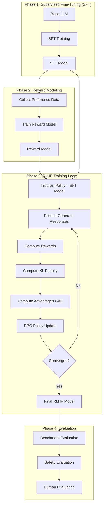

### 7.2 PPO 训练细节

```cpp
// 完整的 PPO RLHF 训练步骤
class PPORLHFTrainer {
public:
    Status TrainStep(
        PolicyEngine* policy,
        RewardEngine* reward,
        RolloutEngine* rollout,
        ReplayBuffer* buffer,
        int step
    ) {
        // ================================================
        // Step 1: Rollout — 收集经验
        // ================================================
        PROFILER_BEGIN_SPAN("rollout");

        // 准备 prompts
        auto prompts = dataset_->SamplePrompts(config_.batch_size);

        // 生成 responses
        auto [responses, logprobs, values, attn_mask] =
            rollout->Generate(prompts);

        // 计算奖励
        auto rewards = reward->Compute({
            .prompts = prompts,
            .responses = responses,
            .attention_mask = attn_mask,
        });

        // 计算 KL 惩罚
        auto kl_penalties = reward->ComputeKLPenalty(
            logprobs,
            policy->GetReferenceLogprobs(responses)
        );

        // 组合奖励
        auto total_rewards = rewards.total + kl_penalties;

        // 存储到 Replay Buffer
        buffer->Push({
            .states = prompts,
            .actions = responses,
            .logprobs = logprobs,
            .values = values,
            .rewards = total_rewards,
            .attention_mask = attn_mask,
        });

        PROFILER_END_SPAN("rollout");

        // ================================================
        // Step 2: 计算 GAE 和 Returns
        // ================================================
        PROFILER_BEGIN_SPAN("compute_gae");

        ComputeGAEAndReturns(
            buffer,
            config_.ppo.gamma,
            config_.ppo.gae_lambda
        );

        PROFILER_END_SPAN("compute_gae");

        // ================================================
        // Step 3: PPO 更新（多个 epoch）
        // ================================================
        PROFILER_BEGIN_SPAN("ppo_update");

        PPOMetrics metrics;

        for (int epoch = 0; epoch < config_.ppo.ppo_epochs; epoch++) {
            // Mini-batch 迭代
            for (auto& mini_batch : buffer->GetMiniBatches(
                     config_.ppo.num_minibatches,
                     config_.ppo.shuffle_minibatches
            )) {
                // 前向传播：获取新的 logprobs 和 values
                auto [new_logprobs, new_values, entropy] =
                    policy->Forward(mini_batch.states, mini_batch.actions);

                // 计算 PPO loss
                auto loss = ComputePPOLoss({
                    .new_logprobs = new_logprobs,
                    .old_logprobs = mini_batch.logprobs,
                    .new_values = new_values,
                    .old_values = mini_batch.values,
                    .advantages = mini_batch.advantages,
                    .returns = mini_batch.returns,
                    .action_mask = mini_batch.attention_mask,
                });

                // 反向传播 + 优化器步进
                policy->Backward(loss.total_loss);
                policy->ClipGradients(config_.ppo.max_grad_norm);
                policy->OptimizerStep();

                // 记录指标
                metrics.policy_loss += loss.policy_loss;
                metrics.value_loss += loss.value_loss;
                metrics.entropy += entropy;
                metrics.approx_kl += loss.approx_kl;
                metrics.clip_frac += loss.clip_frac;
            }

            // Early stopping on KL divergence
            if (config_.ppo.early_stop_on_kl &&
                metrics.approx_kl > config_.ppo.target_kl * epoch) {
                break;
            }
        }

        PROFILER_END_SPAN("ppo_update");

        // ================================================
        // Step 4: 记录和监控
        // ================================================
        LogMetrics(metrics, step);
        if (step % config_.checkpoint_interval == 0) {
            policy->SaveCheckpoint(fmt::format(
                "{}/step_{}.pt", config_.checkpoint_dir, step
            ));
        }

        return Status::OK;
    }

private:
    PPOLossOutput ComputePPOLoss(const PPOInput& input) {
        // PPO Clipped Surrogate Objective
        // L(θ) = E[min(r_t(θ) * A_t, clip(r_t(θ), 1-ε, 1+ε) * A_t)]

        auto ratio = torch::exp(input.new_logprobs - input.old_logprobs);
        auto surr1 = ratio * input.advantages;
        auto surr2 = torch::clamp(
            ratio, 1.0 - clip_epsilon_, 1.0 + clip_epsilon_
        ) * input.advantages;

        auto policy_loss = -torch::min(surr1, surr2).mean();

        // Value Loss (Clipped)
        auto value_pred_clipped = input.old_values + torch::clamp(
            input.new_values - input.old_values,
            -clip_epsilon_, clip_epsilon_
        );
        auto value_loss_1 = (input.new_values - input.returns).pow(2);
        auto value_loss_2 = (value_pred_clipped - input.returns).pow(2);
        auto value_loss = 0.5 * torch::max(value_loss_1, value_loss_2).mean();

        // Entropy Bonus
        auto entropy_loss = -entropy_coef_ * input.entropy.mean();

        // Total
        auto total_loss = policy_loss_coef_ * policy_loss
                        + value_loss_coef_ * value_loss
                        + entropy_loss;

        return {
            .policy_loss = policy_loss.item<float>(),
            .value_loss = value_loss.item<float>(),
            .entropy_loss = entropy_loss.item<float>(),
            .total_loss = total_loss,
            .approx_kl = (input.old_logprobs - input.new_logprobs).mean().item<float>(),
            .clip_frac = ((ratio - 1.0).abs() > clip_epsilon_).float().mean().item<float>(),
        };
    }
};
```

### 7.3 DPO 训练流程

```cpp
// Direct Preference Optimization (DPO) 训练器
class DPOTrainer {
public:
    Status TrainStep(const DPOBatch& batch) {
        // DPO Loss:
        // L_DPO = -E[log σ(β * (log π_θ(y_w|x) / π_ref(y_w|x)
        //                        - log π_θ(y_l|x) / π_ref(y_l|x)))]

        // 获取当前策略的 log probabilities
        auto policy_chosen_logps = policy_->Forward(batch.chosen_input_ids,
                                                     batch.chosen_attention_mask);
        auto policy_rejected_logps = policy_->Forward(batch.rejected_input_ids,
                                                       batch.rejected_attention_mask);

        // 获取参考策略的 log probabilities（冻结，不计算梯度）
        torch::NoGradGuard no_grad;
        auto ref_chosen_logps = ref_policy_->Forward(batch.chosen_input_ids,
                                                      batch.chosen_attention_mask);
        auto ref_rejected_logps = ref_policy_->Forward(batch.rejected_input_ids,
                                                        batch.rejected_attention_mask);

        // 计算 log ratios
        auto chosen_log_ratios = policy_chosen_logps - ref_chosen_logps;
        auto rejected_log_ratios = policy_rejected_logps - ref_rejected_logps;

        // DPO loss
        auto logits = beta_ * (chosen_log_ratios - rejected_log_ratios);
        auto loss = -torch::log_sigmoid(logits).mean();

        // 反向传播
        loss.backward();
        optimizer_->Step();
        optimizer_->ZeroGrad();

        // 指标
        auto accuracy = (logits > 0).float().mean();  // chosen > rejected 的比例
        auto chosen_rewards = beta_ * chosen_log_ratios.detach();
        auto rejected_rewards = beta_ * rejected_log_ratios.detach();
        auto reward_margin = (chosen_rewards - rejected_rewards).mean();

        return Status::OK;
    }
};
```

### 7.4 GRPO 训练流程

```cpp
// Group Relative Policy Optimization (GRPO) 训练器
// 不使用单独的 reward model，而是在组内比较相对质量
class GRPOTrainer {
public:
    Status TrainStep(const GRPOBatch& batch) {
        // GRPO 核心思想：
        // 对于同一个 prompt，生成 K 个 responses
        // 使用组内相对排序来计算优势函数

        int K = config_.grpo.num_samples_per_prompt;  // 每组采样数

        // 1. 对于每个 prompt，生成 K 个 responses
        // 2. 使用 reference model 或 reward model 对 K 个 responses 打分
        // 3. 组内归一化分数作为 advantages
        // 4. 使用 PPO 风格的目标函数更新策略

        // 简化的 GRPO 目标函数：
        // L = E[min(r * A, clip(r, 1-ε, 1+ε) * A) - β * KL(π||π_ref)]

        auto scores = ComputeGroupScores(batch.responses, batch.prompts);
        auto advantages = NormalizeWithinGroup(scores, batch.group_ids);

        // 计算 policy ratio
        auto new_logprobs = policy_->GetLogprobs(batch.responses);
        auto old_logprobs = batch.old_logprobs;
        auto ratio = torch::exp(new_logprobs - old_logprobs);

        // Clipped surrogate
        auto surr1 = ratio * advantages;
        auto surr2 = torch::clamp(ratio, 1.0 - epsilon_, 1.0 + epsilon_) * advantages;
        auto policy_loss = -torch::min(surr1, surr2).mean();

        // KL penalty
        auto kl = ComputeKL(new_logprobs, batch.ref_logprobs);
        auto kl_loss = beta_ * kl;

        auto total_loss = policy_loss + kl_loss;

        total_loss.backward();
        optimizer_->Step();
        optimizer_->ZeroGrad();

        return Status::OK;
    }
};
```

### 7.5 与推理引擎的集成

```cpp
// 统一推理后端接口
// 支持 vLLM, SGLang, TensorRT-LLM

class InferenceBackendFactory {
public:
    static std::unique_ptr<InferenceBackend> Create(
        const std::string& backend_type,
        const InferenceConfig& config
    ) {
        if (backend_type == "vllm") {
            return std::make_unique<vLLMBackend>(config);
        } else if (backend_type == "sglang") {
            return std::make_unique<SGLangBackend>(config);
        } else if (backend_type == "tensorrt_llm") {
            return std::make_unique<TensorRTLLMBackend>(config);
        } else if (backend_type == "turborl_native") {
            return std::make_unique<TurboRLNativeBackend>(config);
        }
        throw std::invalid_argument("Unknown backend: " + backend_type);
    }
};

// TensorRT-LLM 后端实现示例
class TensorRTLLMBackend : public InferenceBackend {
public:
    Status Initialize(const InferenceConfig& config) override {
        // 构建或加载 TensorRT 引擎
        auto engine_path = config.model_path + "/trt_engine";

        if (!fs::exists(engine_path)) {
            // 构建 TensorRT 引擎
            BuildEngine(config.model_path, engine_path, config);
        }

        // 创建 executor
        executor_ = std::make_unique<tensorrt_llm::executor::Executor>(
            engine_path,
            tensorrt_llm::executor::ModelType::kDECODER_ONLY,
            tensorrt_llm::executor::ExecutorConfig{
                .max_beam_width = 1,
                .scheduler_config = {
                    .capacity_scheduler_policy =
                        CapacitySchedulerPolicy::kGUARANTEED_NO_EVICT,
                },
            }
        );

        return Status::OK;
    }

    Tensor Generate(const GenerationRequest& request) override {
        tensorrt_llm::executor::Request trt_request;
        trt_request.inputTokenIds = request.prompt_token_ids;
        trt_request.maxNewTokens = request.max_tokens;

        trt_request.samplingConfig = {
            .temperature = request.temperature,
            .topP = request.top_p,
            .topK = request.top_k,
        };

        auto result = executor_->enqueueRequest(trt_request);
        // ... 处理结果 ...
        return ConvertToTensor(result);
    }

private:
    std::unique_ptr<tensorrt_llm::executor::Executor> executor_;
};
```

---

## 8. API 设计规范

### 8.1 API 设计原则

```text
TurboRL API 设计遵循以下原则:

1. 一致性 (Consistency)
   - 所有模块遵循统一的命名和参数顺序
   - 配置使用一致的 schema 格式
   - 错误处理使用统一的 Status 类型

2. 渐进复杂度 (Progressive Complexity)
   - 简单任务只需 3 行代码
   - 中等任务使用默认配置
   - 高级用户可定制所有细节

3. GPU 透明 (GPU Transparency)
   - 默认所有操作在 GPU 上进行
   - 用户几乎不需要手动管理 GPU 内存
   - 显式的 device 参数可选

4. 异步优先 (Async First)
   - 所有长时间操作提供异步版本
   - 返回 std::future 或 Python Future
   - 同步版本是异步版本的便捷包装

5. RAII 与资源安全 (Resource Safety)
   - 所有 GPU 资源使用 RAII 管理
   - 析构函数自动释放 GPU 内存
   - 异常安全保证
```

### 8.2 Status 错误处理

```cpp
// TurboRL 统一错误处理类型
class Status {
public:
    enum Code {
        OK = 0,
        CANCELLED = 1,
        UNKNOWN = 2,
        INVALID_ARGUMENT = 3,
        DEADLINE_EXCEEDED = 4,
        NOT_FOUND = 5,
        ALREADY_EXISTS = 6,
        PERMISSION_DENIED = 7,
        RESOURCE_EXHAUSTED = 8,
        FAILED_PRECONDITION = 9,
        ABORTED = 10,
        OUT_OF_RANGE = 11,
        UNIMPLEMENTED = 12,
        INTERNAL = 13,
        UNAVAILABLE = 14,
        DATA_LOSS = 15,
        CUDA_ERROR = 100,
        NCCL_ERROR = 101,
        OUT_OF_MEMORY = 102,
    };

    Status(Code code, std::string message = "")
        : code_(code), message_(std::move(message)) {}

    static Status OK() { return Status(Code::OK); }

    bool ok() const { return code_ == Code::OK; }
    Code code() const { return code_; }
    const std::string& message() const { return message_; }

    // Python 绑定使用异常转换
    void RaiseIfError() const {
        if (!ok()) {
            throw TurboRLException(message_, code_);
        }
    }

private:
    Code code_;
    std::string message_;
};

// 错误检查宏
#define TURBORL_CHECK_STATUS(status) \
    do { \
        auto _s = (status); \
        if (!_s.ok()) { \
            LOG(ERROR) << "Status error: " << _s.message(); \
            return _s; \
        } \
    } while (0)

#define TURBORL_CUDA_CHECK(call) \
    do { \
        cudaError_t _err = (call); \
        if (_err != cudaSuccess) { \
            return Status(Status::CUDA_ERROR, \
                fmt::format("CUDA error at {}:{}: {} ({})", \
                    __FILE__, __LINE__, \
                    cudaGetErrorString(_err), (int)_err)); \
        } \
    } while (0)
```

### 8.3 配置系统

```cpp
// 基于 JSON Schema 的配置系统
class Config {
public:
    // 从文件加载
    static Config FromYAML(const std::string& path);
    static Config FromJSON(const std::string& path);

    // 验证（基于 JSON Schema）
    Status Validate() const;

    // 类型安全的访问
    template<typename T>
    T Get(const std::string& key) const;

    template<typename T>
    T Get(const std::string& key, T default_value) const;

    template<typename T>
    void Set(const std::string& key, T value);

    // 嵌套访问
    Config SubConfig(const std::string& key) const;

    // 序列化
    std::string ToJSON() const;
    std::string ToYAML() const;

    // Schema 定义（内置）
    static const std::string& GetSchema();

private:
    nlohmann::json data_;
};
```

### 8.4 日志系统

```cpp
// 基于 spdlog 的异步日志系统
class Logger {
public:
    static Logger& Instance();

    // 初始化
    void Initialize(const LogConfig& config);

    // 日志级别
    void SetLevel(spdlog::level::level_enum level);

    // 获取 logger
    std::shared_ptr<spdlog::logger> Get(const std::string& name = "turborl");

    // 便捷宏
    #define TURBORL_LOG_TRACE(...) Logger::Instance().Get()->trace(__VA_ARGS__)
    #define TURBORL_LOG_DEBUG(...) Logger::Instance().Get()->debug(__VA_ARGS__)
    #define TURBORL_LOG_INFO(...)  Logger::Instance().Get()->info(__VA_ARGS__)
    #define TURBORL_LOG_WARN(...)  Logger::Instance().Get()->warn(__VA_ARGS__)
    #define TURBORL_LOG_ERROR(...) Logger::Instance().Get()->error(__VA_ARGS__)
    #define TURBORL_LOG_CRITICAL(...) Logger::Instance().Get()->critical(__VA_ARGS__)

private:
    LogConfig config_;
    std::shared_ptr<spdlog::logger> logger_;
};

struct LogConfig {
    std::string level = "info";        // trace/debug/info/warn/error/critical
    std::string pattern = "[%Y-%m-%d %H:%M:%S.%e] [%^%l%$] [%s:%#] %v";
    std::string log_dir = "/tmp/turborl_logs";
    int max_file_size_mb = 100;
    int max_files = 10;
    bool console_output = true;
    bool async_logging = true;
    int async_queue_size = 8192;
};
```

---

## 9. Benchmark 设计

### 9.1 Benchmark 框架

```cpp
class BenchmarkSuite {
public:
    struct BenchmarkConfig {
        int warmup_iterations = 10;
        int benchmark_iterations = 100;
        int min_runtime_seconds = 5;
        bool verify_correctness = true;
        std::string output_format = "json";  // json, csv, markdown
        std::string output_path;
    };

    struct BenchmarkResult {
        std::string name;
        std::string category;
        double mean_time_us;
        double median_time_us;
        double p50_time_us;
        double p95_time_us;
        double p99_time_us;
        double std_dev_us;
        double throughput;             // ops/sec
        double gpu_utilization_pct;
        double memory_bandwidth_gbps;
        int64_t memory_used_bytes;
        bool correctness_ok;
        std::map<std::string, std::string> extra_metrics;
    };

    // 注册 benchmark
    void Register(const std::string& name,
                   std::function<void()> fn,
                   const std::string& category = "");

    // 运行
    std::vector<BenchmarkResult> Run(const BenchmarkConfig& config);
    std::vector<BenchmarkResult> RunCategory(const std::string& category);

    // 比较两个运行结果
    static std::string CompareResults(
        const std::vector<BenchmarkResult>& baseline,
        const std::vector<BenchmarkResult>& current,
        double threshold_pct = 5.0  // 超过此阈值视为回归
    );

private:
    struct BenchmarkEntry {
        std::string name;
        std::function<void()> func;
        std::string category;
    };
    std::vector<BenchmarkEntry> entries_;
};
```

### 9.2 标准 Benchmark Suite

```text
TurboRL 标准 Benchmark Suite:

┌─────────────────────────────────────────────────────────────────┐
│ Category: Environment                                            │
├─────────────────────────────────────────────────────────────────┤
│ BM_Env_Step_CartPole_1K         1K envs step throughput        │
│ BM_Env_Step_CartPole_16K        16K envs step throughput       │
│ BM_Env_Step_Atari_1K            1K Atari envs step throughput  │
│ BM_Env_Reset_16K                16K envs reset throughput      │
│ BM_Env_GPU_Utilization          GPU SM/内存利用率               │
├─────────────────────────────────────────────────────────────────┤
│ Category: Replay Buffer                                          │
├─────────────────────────────────────────────────────────────────┤
│ BM_RB_Push_FP32_1M              Push throughput (1M capacity)  │
│ BM_RB_Sample_Uniform_256        Uniform sample (batch=256)     │
│ BM_RB_Sample_PER_256            PER sample (batch=256)         │
│ BM_RB_NStep_Return              N-step return computation      │
│ BM_RB_Memory_Bandwidth          内存带宽利用率                   │
├─────────────────────────────────────────────────────────────────┤
│ Category: Inference                                              │
├─────────────────────────────────────────────────────────────────┤
│ BM_Inference_vLLM_Llama7B       vLLM throughput (Llama-7B)     │
│ BM_Inference_SGLang_Llama7B     SGLang throughput              │
│ BM_Inference_TRTLLM_Llama7B     TRT-LLM throughput             │
│ BM_Inference_BS1_Latency        Single batch latency           │
│ BM_Inference_MaxThroughput      Max throughput sweep           │
├─────────────────────────────────────────────────────────────────┤
│ Category: Policy Update                                          │
├─────────────────────────────────────────────────────────────────┤
│ BM_PPO_Update_1K_Seq            1K seq PPO update step time    │
│ BM_PPO_GAE_Compute              GAE computation throughput     │
│ BM_PPO_Loss_Forward             PPO loss forward time          │
│ BM_DPO_Update_1K_Seq            DPO update step time           │
├─────────────────────────────────────────────────────────────────┤
│ Category: Distributed                                            │
├─────────────────────────────────────────────────────────────────┤
│ BM_NCCL_AllReduce_1GB           AllReduce 1GB bandwidth        │
│ BM_NCCL_AllGather_1GB           AllGather 1GB bandwidth        │
│ BM_DDP_Scaling_8GPU             DDP scaling efficiency         │
│ BM_FSDP_Scaling_32GPU           FSDP scaling efficiency        │
├─────────────────────────────────────────────────────────────────┤
│ Category: End-to-End                                             │
├─────────────────────────────────────────────────────────────────┤
│ BM_E2E_PPO_CartPole             E2E PPO training speed         │
│ BM_E2E_RLHF_Llama7B             E2E RLHF training step         │
│ BM_E2E_DPO_Llama7B              E2E DPO training step          │
│ BM_E2E_Convergence              Sample efficiency benchmark    │
└─────────────────────────────────────────────────────────────────┘
```

### 9.3 基准测试环境

```text
标准 Benchmark 环境:

Hardware Tier 1 (Primary):
  - GPU: 8x NVIDIA A100-80GB SXM4
  - CPU: 2x AMD EPYC 7742 (128 cores)
  - RAM: 2TB DDR4
  - Interconnect: NVSwitch + InfiniBand HDR (200 Gbps)
  - Storage: 30TB NVMe RAID0

Hardware Tier 2 (Cloud):
  - GPU: 8x NVIDIA L40S-48GB
  - CPU: 2x Intel Xeon 8480+ (112 cores)
  - RAM: 1TB DDR5
  - Interconnect: NVLink + 100 GbE
  - Storage: 15TB NVMe

Hardware Tier 3 (Entry):
  - GPU: 1x NVIDIA RTX 4090-24GB
  - CPU: Intel Core i9-13900K
  - RAM: 64GB DDR5
  - Storage: 2TB NVMe

Software:
  - OS: Ubuntu 22.04 LTS
  - CUDA: 13.0
  - Driver: 550.x+
  - PyTorch: 2.6+
  - NCCL: 2.21+
  - Docker: 24.0+
```

### 9.4 对比实验设计

```yaml
# benchmark_comparison.yaml
comparisons:
  - name: "TurboRL vs OpenRLHF vs TRL"
    metrics:
      - training_step_time_ms
      - throughput_samples_per_sec
      - gpu_memory_used_gb
      - convergence_steps
    baselines:
      - name: "OpenRLHF"
        repo: "https://github.com/OpenRLHF/OpenRLHF"
        commit: "latest"
      - name: "TRL"
        repo: "https://github.com/huggingface/trl"
        commit: "latest"
      - name: "DeepSpeed-Chat"
        repo: "https://github.com/microsoft/DeepSpeedExamples"
        commit: "latest"
    tasks:
      - "PPO RLHF with Llama-3-8B"
      - "DPO with Mistral-7B"
      - "GRPO with Qwen2-7B"
```

---

## 10. CI/CD 与工程规范

### 10.1 GitHub Actions CI/CD

```yaml
# .github/workflows/ci.yml
name: TurboRL CI

on:
  push:
    branches: [main, develop]
  pull_request:
    branches: [main]

concurrency:
  group: ${{ github.workflow }}-${{ github.ref }}
  cancel-in-progress: true

jobs:
  # =============================================
  # Lint & Format Check
  # =============================================
  lint:
    runs-on: ubuntu-22.04
    steps:
      - uses: actions/checkout@v4
      - name: C++ Lint (clang-format)
        run: |
          find src/ include/ -name '*.cpp' -o -name '*.h' -o -name '*.cu' | \
            xargs clang-format --dry-run --Werror
      - name: C++ Lint (clang-tidy)
        run: |
          cmake -B build -DTURBORL_ENABLE_LINT=ON
          cmake --build build --target turborl-lint
      - name: Python Lint (ruff)
        run: |
          pip install ruff
          ruff check python/
          ruff format --check python/
      - name: CMake Lint
        run: |
          pip install cmakelang
          cmake-lint CMakeLists.txt cmake/*.cmake

  # =============================================
  # Build & Unit Tests (CPU-only)
  # =============================================
  build-and-test-cpu:
    needs: lint
    runs-on: ubuntu-22.04
    strategy:
      matrix:
        build_type: [Debug, Release]
        compiler: [gcc-12, clang-17]
    steps:
      - uses: actions/checkout@v4
      - name: Install Dependencies
        run: |
          sudo apt-get update
          sudo apt-get install -y cmake ninja-build libspdlog-dev \
            libyaml-cpp-dev libhdf5-dev
      - name: Configure
        run: |
          cmake -B build -G Ninja \
            -DCMAKE_BUILD_TYPE=${{ matrix.build_type }} \
            -DCMAKE_CXX_COMPILER=${{ matrix.compiler }} \
            -DTURBORL_ENABLE_CUDA=OFF \
            -DTURBORL_ENABLE_TESTING=ON
      - name: Build
        run: cmake --build build -j$(nproc)
      - name: Test
        run: |
          cd build
          ctest --output-on-failure -j$(nproc) \
            --test-dir . --label-regex "unit"

  # =============================================
  # GPU Tests (Self-hosted runner)
  # =============================================
  gpu-tests:
    needs: lint
    runs-on: [self-hosted, gpu, a100]
    strategy:
      matrix:
        cuda_version: ["12.6", "13.0"]
    steps:
      - uses: actions/checkout@v4
      - name: Build with CUDA
        run: |
          cmake -B build -G Ninja \
            -DCMAKE_BUILD_TYPE=Release \
            -DTURBORL_ENABLE_CUDA=ON \
            -DCMAKE_CUDA_ARCHITECTURES="80;89;90" \
            -DTURBORL_ENABLE_TESTING=ON \
            -DTURBORL_ENABLE_BENCHMARK=ON
          cmake --build build -j$(nproc)
      - name: Unit Tests (CUDA)
        run: |
          cd build
          ctest --output-on-failure -j1 \
            --test-dir . --label-regex "cuda"
      - name: Integration Tests
        run: |
          cd build
          ctest --output-on-failure -j1 \
            --test-dir . --label-regex "integration"
      - name: Benchmark Regression
        run: |
          cd build
          ./benchmarks/turborl_benchmark \
            --benchmark_format=json \
            --benchmark_out=benchmark_results.json
          python ../scripts/check_benchmark_regression.py \
            --baseline=../.github/benchmark_baselines/a100.json \
            --current=benchmark_results.json \
            --threshold=5.0

  # =============================================
  # Python Tests
  # =============================================
  python-tests:
    needs: build-and-test-cpu
    runs-on: ubuntu-22.04
    steps:
      - uses: actions/checkout@v4
      - name: Setup Python
        uses: actions/setup-python@v5
        with:
          python-version: "3.11"
      - name: Install
        run: |
          pip install -e ".[dev,test]"
      - name: Test
        run: |
          pytest python/tests/ -v --cov=turborl --cov-report=xml
      - name: Upload Coverage
        uses: codecov/codecov-action@v4
        with:
          file: ./coverage.xml

  # =============================================
  # Documentation Build
  # =============================================
  docs:
    needs: lint
    runs-on: ubuntu-22.04
    steps:
      - uses: actions/checkout@v4
      - name: Build C++ Docs (Doxygen)
        run: |
          sudo apt-get install -y doxygen graphviz
          cd docs
          doxygen Doxyfile
      - name: Build Python Docs (Sphinx)
        run: |
          pip install sphinx sphinx-rtd-theme myst-parser
          cd docs
          make html
      - name: Deploy to GitHub Pages
        if: github.ref == 'refs/heads/main'
        uses: peaceiris/actions-gh-pages@v3
        with:
          github_token: ${{ secrets.GITHUB_TOKEN }}
          publish_dir: ./docs/_build/html

  # =============================================
  # Docker Build & Push
  # =============================================
  docker:
    needs: [build-and-test-cpu, python-tests]
    if: github.ref == 'refs/heads/main'
    runs-on: ubuntu-22.04
    strategy:
      matrix:
        image:
          - { name: "turborl", dockerfile: "Dockerfile" }
          - { name: "turborl-cuda", dockerfile: "Dockerfile.cuda" }
          - { name: "turborl-dev", dockerfile: "Dockerfile.dev" }
    steps:
      - uses: actions/checkout@v4
      - name: Login to GitHub Container Registry
        uses: docker/login-action@v3
        with:
          registry: ghcr.io
          username: ${{ github.actor }}
          password: ${{ secrets.GITHUB_TOKEN }}
      - name: Build and Push
        uses: docker/build-push-action@v5
        with:
          context: .
          file: docker/${{ matrix.image.dockerfile }}
          push: true
          tags: |
            ghcr.io/${{ github.repository }}/${{ matrix.image.name }}:latest
            ghcr.io/${{ github.repository }}/${{ matrix.image.name }}:${{ github.sha }}
```

### 10.2 Docker 配置

```dockerfile
# docker/Dockerfile.cuda
# TurboRL CUDA 运行时镜像
FROM nvidia/cuda:13.0.0-devel-ubuntu22.04

LABEL maintainer="TurboRL Team"
LABEL description="TurboRL - High Performance RL & RLHF Infrastructure"

# 系统依赖
RUN apt-get update && apt-get install -y --no-install-recommends \
    build-essential \
    cmake \
    ninja-build \
    git \
    curl \
    wget \
    libspdlog-dev \
    libyaml-cpp-dev \
    libhdf5-dev \
    libopenmpi-dev \
    python3.11 \
    python3.11-dev \
    python3-pip \
    && rm -rf /var/lib/apt/lists/*

# 安装 Python 依赖
COPY requirements.txt /tmp/
RUN pip install --no-cache-dir -r /tmp/requirements.txt

# 安装 NCCL
RUN wget https://developer.download.nvidia.com/compute/cuda/repos/ubuntu2204/x86_64/cuda-keyring_1.1-1_all.deb \
    && dpkg -i cuda-keyring_1.1-1_all.deb \
    && apt-get update \
    && apt-get install -y libnccl2 libnccl-dev

# 构建 TurboRL
COPY . /workspace/turborl
WORKDIR /workspace/turborl
RUN cmake -B build -G Ninja \
    -DCMAKE_BUILD_TYPE=Release \
    -DTURBORL_ENABLE_CUDA=ON \
    -DCMAKE_CUDA_ARCHITECTURES="80;89;90" \
    && cmake --build build -j$(nproc) \
    && cmake --install build --prefix /usr/local

# Python 绑定
RUN pip install -e python/

# 入口
WORKDIR /workspace
ENTRYPOINT ["python3", "-m", "turborl"]
```

### 10.3 代码规范

```text
┌─────────────────────────────────────────────────────────────────┐
│                    TurboRL 代码规范                               │
├─────────────────────────────────────────────────────────────────┤
│                                                                   │
│  C++ 代码规范 (Google C++ Style + 扩展):                          │
│                                                                   │
│  • 缩进: 4 spaces, no tabs                                       │
│  • 行宽: 100 characters                                          │
│  • 命名:                                                          │
│    - 类/结构体: PascalCase (e.g., ReplayBuffer)                  │
│    - 函数/方法: PascalCase (e.g., SampleBatch)                   │
│    - 变量: snake_case (e.g., num_envs)                           │
│    - 常量: kPascalCase (e.g., kMaxCapacity)                      │
│    - 宏: UPPER_SNAKE_CASE (e.g., TURBORL_CUDA_CHECK)             │
│    - 命名空间: snake_case (e.g., turborl::replay_buffer)         │
│  • 头文件: #pragma once                                          │
│  • 智能指针: std::unique_ptr / std::shared_ptr                   │
│  • 禁止: raw new/delete, C-style cast                            │
│  • 现代 C++: auto, range-for, std::optional, std::variant        │
│                                                                   │
│  CUDA 代码规范:                                                   │
│                                                                   │
│  • Kernel 名前缀: <Module>_<Op>_<Type>Kernel                     │
│  • 设备函数: __device__ camelCase                                │
│  • 使用 cooperative_groups 替代 warp 内联汇编                     │
│  • 每个 kernel 文件包含 launch 配置注释                           │
│                                                                   │
│  Python 代码规范 (PEP 8 + 扩展):                                  │
│                                                                   │
│  • 行宽: 88 characters (Black 默认)                               │
│  • 类型注解: 所有公开 API 必须有类型注解                            │
│  • Docstring: Google-style (Args, Returns, Raises)               │
│  • Import 顺序: stdlib → third-party → turborl                    │
│                                                                   │
└─────────────────────────────────────────────────────────────────┘
```

### 10.4 Doxygen 配置

```text
# docs/Doxyfile 关键配置
PROJECT_NAME           = "TurboRL"
PROJECT_BRIEF          = "High Performance RL & RLHF Infrastructure"
OUTPUT_DIRECTORY       = _build/doxygen
GENERATE_HTML          = YES
GENERATE_XML           = YES
EXTRACT_ALL            = YES
EXTRACT_PRIVATE        = YES
EXTRACT_STATIC         = YES
RECURSIVE              = YES
INPUT                  = ../include ../src ../README.md
FILE_PATTERNS          = *.h *.cpp *.cu *.md
ENABLE_PREPROCESSING   = YES
MACRO_EXPANSION        = YES
EXPAND_ONLY_PREDEF     = YES
PREDEFINED             = TURBORL_API= __device__= __host__= __global__=
GENERATE_GRAPHVIZ      = YES
HAVE_DOT               = YES
UML_LOOK               = YES
CALL_GRAPH             = YES
CALLER_GRAPH           = YES
```

---

## 11. 完整开发 Roadmap

### 11.1 整体时间线

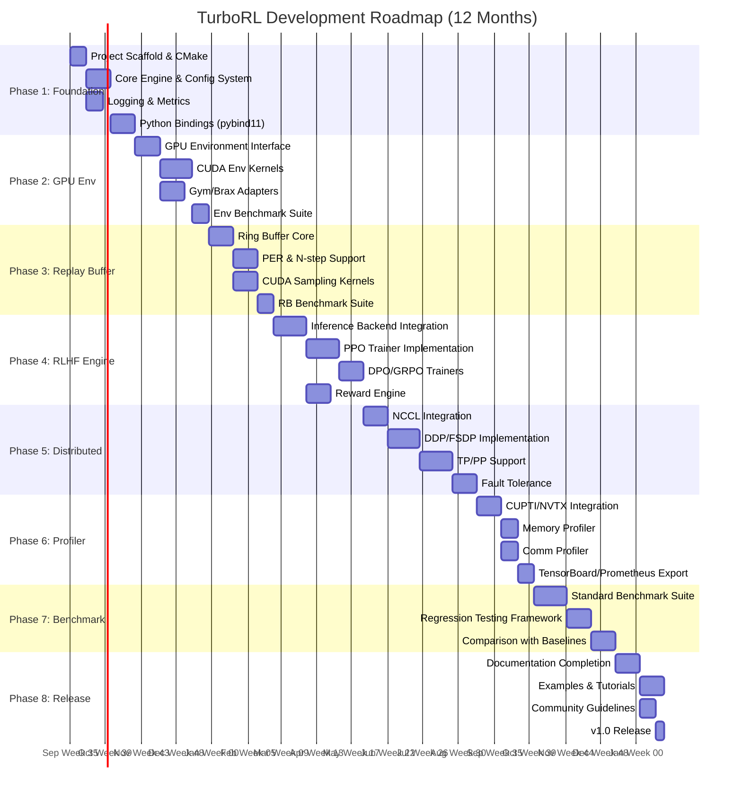

### 11.2 各阶段详细规划

#### Phase 1: 基础框架 (Month 1-2, Week 1-8)

```text
目标: 建立项目骨架，实现 Core Engine，建立 CI/CD 流水线

里程碑 M1.1 — 项目骨架 (Week 1-2):
□ 创建项目目录结构和 CMake 构建系统
□ 配置 vcpkg 依赖管理
□ 集成 clang-format, clang-tidy, ruff
□ 编写 .clang-format, .clang-tidy 配置
□ 编写 pyproject.toml / setup.py
□ 初始化 GitHub Actions CI/CD
□ 创建 Docker 基础镜像

里程碑 M1.2 — Core Engine (Week 3-5):
□ 实现 Config 系统 (YAML/JSON + JSON Schema 验证)
□ 实现 Logger 系统 (spdlog + async)
□ 实现线程池 (ThreadPool)
□ 实现 CUDA Stream Pool (StreamPool)
□ 实现任务调度器 (TaskScheduler with DAG)
□ 实现 Metrics Collector
□ 实现 Module 接口和生命周期管理

里程碑 M1.3 — Python 绑定 (Week 5-8):
□ 配置 pybind11 环境
□ 绑定 Core Engine 到 Python
□ 绑定 Config 系统
□ 绑定 Logger
□ 实现 Torch Extension 基础框架
□ 编写 Python 包分发配置
□ 编写 Python 单元测试
```

#### Phase 2: GPU Environment (Month 2-3, Week 8-14)

```text
目标: 实现 GPU-native 环境管理和批量环境交互

里程碑 M2.1 — 环境接口 (Week 8-10):
□ 设计 GPUEnvironment 虚基类
□ 实现 VectorizedEnv 管理框架
□ 设计 EnvConfig 配置结构
□ 实现 EnvFactory 注册机制
□ 编写环境接口文档

里程碑 M2.2 — CUDA 环境内核 (Week 10-13):
□ 实现 ResetEnvs CUDA kernel
□ 实现 StepDynamics CUDA kernel (以 CartPole 为例)
□ 实现批量 Reward 计算 kernel
□ 实现终止条件检测 kernel
□ 实现环境 RNG 状态管理
□ 使用 float4 向量化优化内存带宽

里程碑 M2.3 — 适配器 (Week 10-13):
□ 实现 GymGPUAdapter (CPU Gym -> GPU bridge)
□ 实现 Brax 环境直接集成
□ 实现环境自动重置 (AutoReset)
□ 实现环境统计 (EnvStats)

里程碑 M2.4 — 基准测试 (Week 13-14):
□ 编写环境吞吐量 benchmark
□ 编写延迟 benchmark
□ 与 Gym/Gymnasium 对比
□ 性能报告模板
```

#### Phase 3: Replay Buffer (Month 3-4, Week 14-19)

```text
目标: 实现 GPU-native Replay Buffer

里程碑 M3.1 — Ring Buffer (Week 14-16):
□ 实现 GPURingBuffer 模板类
□ 实现原子 Push 操作
□ 实现批量 Read 操作
□ 实现线程安全机制
□ 单元测试覆盖

里程碑 M3.2 — PER (Week 16-18):
□ 实现 GPU Segment Tree
□ 实现优先级采样 kernel
□ 实现重要性采样权重计算
□ 实现优先级更新接口

里程碑 M3.3 — 高级特性 (Week 17-19):
□ 实现 N-step returns 计算
□ 实现 Hindsight Experience Replay
□ 实现批量 Priority Update
□ 实现 Replay Buffer 持久化 (checkpoint)

里程碑 M3.4 — 基准测试 (Week 18-19):
□ Push/Sample 吞吐量 benchmark
□ PER vs Uniform 性能对比
□ 不同容量/批大小的性能分析
```

#### Phase 4: RLHF Engine (Month 4-6, Week 19-27)

```text
目标: 实现 RLHF 核心训练引擎

里程碑 M4.1 — 推理后端 (Week 19-22):
□ 设计 InferenceBackend 接口
□ 实现 vLLM 后端集成
□ 实现 SGLang 后端集成
□ 实现 TensorRT-LLM 后端集成
□ 实现 KV Cache 管理器
□ 实现异步 Rollout 流水线

里程碑 M4.2 — PPO 训练器 (Week 22-25):
□ 实现 Actor-Critic 策略框架
□ 实现 GAE 计算 (CUDA kernel)
□ 实现 PPO 损失函数 (CUDA kernel)
□ 实现 PPO 更新循环
□ 实现混合精度训练
□ 实现梯度累积

里程碑 M4.3 — DPO/GRPO (Week 24-26):
□ 实现 DPO 损失函数
□ 实现 DPO 训练循环
□ 实现 GRPO 损失函数
□ 实现 GRPO 组内采样

里程碑 M4.4 — Reward Engine (Week 21-24):
□ 实现 RewardModel 接口
□ 实现 KL Penalty 计算
□ 实现 Rule-based Reward
□ 实现 Reward Normalizer
□ 实现 Composite Reward 组合
```

#### Phase 5: Distributed Training (Month 6-8, Week 27-35)

```text
目标: 实现多 GPU/多节点分布式训练

里程碑 M5.1 — NCCL 集成 (Week 27-29):
□ 实现 ProcessGroup 抽象
□ NCCL Communicator 实现
□ NVSHMEM Communicator (可选)
□ 通信操作基准测试

里程碑 M5.2 — DDP/FSDP (Week 29-32):
□ 实现 DistributedDataParallel
□ 实现 Gradient Bucketing
□ 实现通信计算重叠
□ 实现 ZeRO Stage 1/2
□ 实现 ZeRO Stage 3 (参数分片)

里程碑 M5.3 — TP/PP (Week 31-34):
□ 实现 Tensor Parallel (Column/Row wise)
□ 实现 Pipeline Parallel (1F1B schedule)
□ 实现 3D Parallel 组合
□ TP/PP scaling 效率验证

里程碑 M5.4 — 容错 (Week 33-35):
□ 实现心跳检测机制
□ 实现 Checkpoint 自动保存
□ 实现训练恢复逻辑
□ 实现动态节点扩缩容
```

#### Phase 6: Profiler (Month 8-9, Week 35-40)

```text
目标: 实现全链路性能分析工具

里程碑 M6.1 — CUPTI/NVTX (Week 35-37):
□ CUPTI Activity API 集成
□ NVTX Range 标记系统
□ CUDA Kernel 时间线收集
□ Chrome Trace 导出

里程碑 M6.2 — 内存分析 (Week 37-38):
□ 显存分配/释放追踪
□ 峰值显存检测
□ 显存泄漏检测
□ 显存时间线可视化

里程碑 M6.3 — 通信分析 (Week 37-39):
□ NCCL 操作记录
□ 通信带宽统计
□ 通信时间占比分析

里程碑 M6.4 — 导出 (Week 39-40):
□ TensorBoard 集成
□ Prometheus metrics 导出
□ ProfilerReport 生成
□ 自动化性能回归检测
```

#### Phase 7: Benchmark (Month 9-10, Week 40-46)

```text
目标: 建立标准化基准测试体系

里程碑 M7.1 — Benchmark 框架 (Week 40-43):
□ BenchmarkSuite 框架
□ 自动化 Benchmark 运行
□ 结果 JSON 导出
□ 历史结果数据库

里程碑 M7.2 — 标准 Suite (Week 43-44):
□ 环境 Benchmark 套件
□ Replay Buffer Benchmark 套件
□ 推理 Benchmark 套件
□ 分布式 Benchmark 套件
□ 端到端 Benchmark 套件

里程碑 M7.3 — 对比测试 (Week 44-46):
□ 与 OpenRLHF 对比
□ 与 TRL 对比
□ 与 DeepSpeed-Chat 对比
□ 对比报告生成
```

#### Phase 8: Release v1.0 (Month 10-12, Week 46-52)

```text
目标: 文档完善、社区建设、v1.0 发布

里程碑 M8.1 — 文档 (Week 46-48):
□ Doxygen C++ API 文档
□ Sphinx Python API 文档
□ Architecture Design Doc
□ User Guide / Getting Started
□ Migration Guide (from TRL/OpenRLHF)

里程碑 M8.2 — 教程 (Week 48-50):
□ Quickstart Tutorial
□ PPO RLHF Training Tutorial
□ DPO Training Tutorial
□ Custom Environment Tutorial
□ Performance Tuning Guide

里程碑 M8.3 — 社区 (Week 48-50):
□ CONTRIBUTING.md
□ CODE_OF_CONDUCT.md
□ Issue Templates
□ PR Templates
□ GitHub Discussions 配置

里程碑 M8.4 — Release (Week 50-52):
□ v1.0 Release Notes
□ PyPI 发布
□ Docker Hub 发布
□ Blog Post / 技术文章
□ Community Launch
```

### 11.3 里程碑总览

```text
┌─────────────┬──────────────┬──────────────────────────────────┐
│ Milestone   │ Timeline      │ Deliverables                     │
├─────────────┼──────────────┼──────────────────────────────────┤
│ M1.1        │ Week 1-2     │ CMake build, CI/CD, Docker        │
│ M1.2        │ Week 3-5     │ Core Engine, Config, Logging      │
│ M1.3        │ Week 5-8     │ Python bindings                   │
│ M2.1        │ Week 8-10    │ GPU Env Interface                 │
│ M2.4        │ Week 13-14   │ Env Benchmark                     │
│ M3.1        │ Week 14-16   │ Ring Buffer                       │
│ M3.4        │ Week 18-19   │ Replay Buffer Benchmark           │
│ M4.1        │ Week 19-22   │ Inference Backend Integration     │
│ M4.4        │ Week 21-24   │ Reward Engine                     │
│ M5.2        │ Week 29-32   │ DDP/FSDP                         │
│ M5.4        │ Week 33-35   │ Fault Tolerance                   │
│ M6.4        │ Week 39-40   │ Profiler Export                   │
│ M7.3        │ Week 44-46   │ Baseline Comparison               │
│ M8.4        │ Week 50-52   │ v1.0 Release                     │
└─────────────┴──────────────┴──────────────────────────────────┘
```

---

## 12. README & 社区文档

### 12.1 README.md

```markdown
# TurboRL

<div align="center">

[](LICENSE)
[](https://developer.nvidia.com/cuda-toolkit)
[](https://isocpp.org/)
[](https://www.python.org/)
[](https://github.com/turborl/turborl/actions/workflows/ci.yml)
[](https://turborl.readthedocs.io/)
[](https://pypi.org/project/turborl/)

**High Performance RL & RLHF Infrastructure powered by CUDA and C++**

</div>

---

## 🚀 Overview

TurboRL is a next-generation infrastructure for Reinforcement Learning (RL)
and RL from Human Feedback (RLHF). It provides **GPU-native** acceleration
across the entire training pipeline — from environment interaction to
replay buffering to policy updates — eliminating CPU bottlenecks and
maximizing hardware utilization.

### Why TurboRL?

| Feature | TurboRL | Gym + TRL | OpenRLHF |
|---------|---------|-----------|----------|
| **GPU-native Envs** | ✅ 16K concurrent | ❌ CPU-only | ❌ N/A |
| **GPU Replay Buffer** | ✅ > 5M samples/s | ❌ CPU numpy | ⚠️ Limited |
| **CUDA Kernels** | ✅ Custom + CUTLASS | ❌ | ❌ |
| **Multi-backend Inference** | ✅ vLLM/SGLang/TRT-LLM | ❌ | ⚠️ vLLM only |
| **3D Parallelism** | ✅ DP+TP+PP | ❌ | ⚠️ |
| **Built-in Profiler** | ✅ CUPTI+NVTX | ❌ | ❌ |
| **End-to-end GPU** | ✅ | ❌ | ❌ |

### Architecture

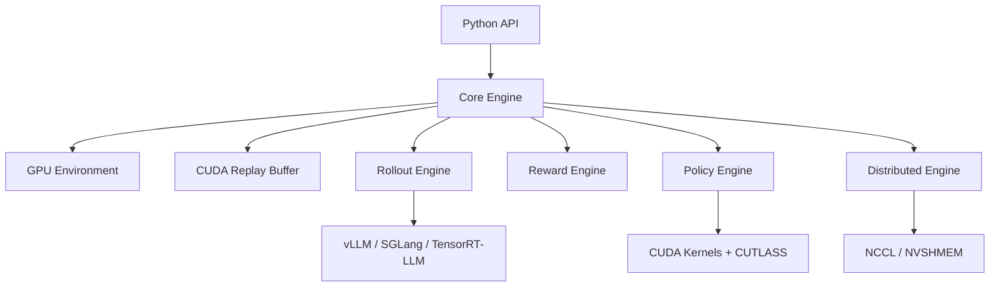

## 📦 Installation

### Prerequisites

- NVIDIA GPU with CUDA 12.6+ (recommended: A100, H100, or RTX 4090)
- Python 3.10+
- CMake 3.28+
- GCC 12+ or Clang 17+

### Quick Install

```bash
# From PyPI (CPU-only)
pip install turborl

# From PyPI (with CUDA)
pip install turborl[cuda]

# Development install
git clone https://github.com/turborl/turborl.git
cd turborl
pip install -e ".[dev,cuda]"
```

### Docker

```bash
docker pull ghcr.io/turborl/turborl-cuda:latest
docker run --gpus all -it ghcr.io/turborl/turborl-cuda:latest
```

## 🏃 Quick Start

### 3-Line Example

```python
import turborl

# Create GPU-accelerated environment
env = turborl.make("CartPole-v1", num_envs=4096, device="cuda:0")

# Run 10M steps in seconds
states = env.reset()
for _ in range(10000):
    actions = policy(states)
    states, rewards, dones, _ = env.step(actions)
```

### RLHF Training (PPO)

```python
from turborl import (
    PPOTrainer, RolloutEngine, RewardEngine,
    ReplayBuffer, make
)

# Initialize components
rollout = RolloutEngine("vllm", model="meta-llama/Llama-3-8B")
reward = RewardEngine(reward_model="OpenAssistant/reward-model-deberta-v3")
buffer = ReplayBuffer(capacity=1_000_000, obs_dim=4096, act_dim=4096)
trainer = PPOTrainer(model="meta-llama/Llama-3-8B")

# Training loop
for step in range(1000):
    responses = rollout.generate(prompts)
    rewards = reward.compute(prompts, responses)
    buffer.push(prompts, responses, rewards)
    batch = buffer.sample(batch_size=256)
    loss = trainer.update(batch)
    print(f"Step {step}: loss={loss:.4f}, reward={rewards.mean():.4f}")
```

## 📊 Benchmarks

| Benchmark                       | TurboRL            | Baseline            | Speedup  |
| ------------------------------- | ------------------ | ------------------- | -------- |
| CartPole Step (16K envs)        | **12.4M steps/s**  | 50K steps/s (Gym)   | **248x** |
| ReplayBuffer Sample (batch=256) | **5.2M samples/s** | 200K samples/s      | **26x**  |
| PPO Update (Llama-8B, seq=2048) | **1.2s/step**      | 2.8s/step (TRL)     | **2.3x** |
| AllReduce 1GB (8x A100)         | **285 GB/s**       | 280 GB/s (NCCL max) | **~max** |

## 🗺️ Roadmap

See [ROADMAP.md](ROADMAP.md) for the full development plan.

- ✅ Phase 1: Foundation (Core Engine, Config, Python Bindings)
- ✅ Phase 2: GPU Environment (Vectorized Envs, CUDA Env Kernels)
- 🚧 Phase 3: Replay Buffer (Ring Buffer, PER, N-step)
- 📅 Phase 4: RLHF Engine (vLLM/SGLang/TRT-LLM, PPO/DPO/GRPO)
- 📅 Phase 5: Distributed (NCCL, DDP/FSDP, TP/PP, Fault Tolerance)
- 📅 Phase 6: Profiler (CUPTI, Memory, Communication)
- 📅 Phase 7: Benchmark Suite (Standard + Comparison)
- 📅 Phase 8: v1.0 Release

## 🤝 Contributing

We welcome contributions! See [CONTRIBUTING.md](CONTRIBUTING.md) for guidelines.

## 📄 License

TurboRL is released under the [Apache 2.0 License](LICENSE).

## 🙏 Acknowledgements

TurboRL builds upon the excellent work of:

- [vLLM](https://github.com/vllm-project/vllm) — High-throughput LLM serving
- [SGLang](https://github.com/sgl-project/sglang) — Structured generation
- [TensorRT-LLM](https://github.com/NVIDIA/TensorRT-LLM) — NVIDIA inference
- [CUTLASS](https://github.com/NVIDIA/cutlass) — CUDA templates
- [OpenRLHF](https://github.com/OpenRLHF/OpenRLHF) — RLHF framework
- [TRL](https://github.com/huggingface/trl) — Transformer RL

## 📧 Contact

- GitHub Issues: [github.com/turborl/turborl/issues](https://github.com/turborl/turborl/issues)

- Discord: [discord.gg/turborl](https://discord.gg/turborl)

- Email: team@turborl.org
  
  ```
  
  ```

### 12.2 CONTRIBUTING.md

```markdown
# Contributing to TurboRL

Thank you for your interest in contributing to TurboRL!

## Table of Contents

1. [Code of Conduct](#code-of-conduct)
2. [Getting Started](#getting-started)
3. [Development Workflow](#development-workflow)
4. [Coding Standards](#coding-standards)
5. [Testing](#testing)
6. [Pull Request Process](#pull-request-process)
7. [Issue Guidelines](#issue-guidelines)
8. [Community](#community)

## Code of Conduct

This project adheres to the [Contributor Covenant](CODE_OF_CONDUCT.md).
Please read it before participating.

## Getting Started

### Prerequisites

- NVIDIA GPU with CUDA 12.6+
- CMake 3.28+
- GCC 12+ or Clang 17+
- Python 3.10+

### Setup Development Environment

```bash
git clone https://github.com/turborl/turborl.git
cd turborl
pip install -e ".[dev]"

# Install pre-commit hooks
pre-commit install

# Build C++ components
cmake -B build -G Ninja \
    -DCMAKE_BUILD_TYPE=Debug \
    -DTURBORL_ENABLE_CUDA=ON \
    -DTURBORL_ENABLE_TESTING=ON
cmake --build build -j$(nproc)
```

### Project Structure

```text
turborl/
├── include/turborl/    # Public headers
├── src/                # C++/CUDA implementation
├── python/turborl/     # Python package
├── tests/              # Test suites
├── docs/               # Documentation
├── benchmarks/         # Benchmark code
├── examples/           # Example scripts
└── docker/             # Docker configurations
```

## Development Workflow

1. **Fork** the repository
2. **Create a branch**: `git checkout -b feature/your-feature-name`
3. **Make changes**: Follow coding standards
4. **Write tests**: New features must include tests
5. **Run tests**: `ctest --test-dir build --output-on-failure`
6. **Format code**: `pre-commit run --all-files`
7. **Commit**: Use [Conventional Commits](https://www.conventionalcommits.org/)
8. **Push**: `git push origin feature/your-feature-name`
9. **Open PR**: Fill out the PR template

### Commit Message Format

```text
<type>(<scope>): <description>

[optional body]

[optional footer(s)]
```

Types: `feat`, `fix`, `docs`, `style`, `refactor`, `perf`, `test`,
        `chore`, `ci`, `build`

Examples:

- `feat(replay_buffer): add prioritized experience replay support`
- `fix(cuda): resolve bank conflicts in GAE kernel`
- `perf(env): optimize vectorized step with float4 loads`

## Coding Standards

### C++ (Google C++ Style)

- Use `.clang-format` for auto-formatting
- Run `clang-tidy` before committing
- Use `#pragma once` for header guards
- Use smart pointers, avoid raw `new`/`delete`
- CUDA kernels: follow kernel naming conventions

### Python (PEP 8)

- Use `ruff format` for auto-formatting
- Use `ruff check` for linting
- All public APIs must have type annotations
- Use Google-style docstrings

## Testing

### Unit Tests (C++)

```bash
cd build
ctest --output-on-failure -R unit
```

### Python Tests

```bash
pytest python/tests/ -v --cov=turborl
```

### CUDA Tests

```bash
cd build
ctest --output-on-failure -R cuda
```

### Benchmark Regression Tests

```bash
cd build
./benchmarks/turborl_benchmark
python scripts/check_benchmark_regression.py
```

## Pull Request Process

1. Ensure all CI checks pass (lint, test, build)
2. Add/update documentation for any public API changes
3. Add entry to CHANGELOG.md under "Unreleased"
4. Request review from at least one maintainer
5. Address review feedback
6. Squash merge when approved

### PR Template

```markdown
## Description
<!-- Describe your changes in detail -->

## Type of Change
- [ ] Bug fix
- [ ] New feature
- [ ] Breaking change
- [ ] Documentation update
- [ ] Performance improvement

## Checklist
- [ ] I have added tests that prove my fix/feature works
- [ ] I have updated the documentation accordingly
- [ ] I have run pre-commit checks (`pre-commit run --all-files`)
- [ ] I have added a CHANGELOG entry
- [ ] All CI checks are passing

## Performance Impact (if applicable)
<!-- Describe the performance impact of your changes -->
```

## Issue Guidelines

### Bug Reports

Use the [Bug Report Template](.github/ISSUE_TEMPLATE/bug_report.md)

### Feature Requests

Use the [Feature Request Template](.github/ISSUE_TEMPLATE/feature_request.md)

## Community

- Discord: [discord.gg/turborl](https://discord.gg/turborl)
- GitHub Discussions: [github.com/turborl/turborl/discussions](https://github.com/turborl/turborl/discussions)
  
  ```
  
  ```

### 12.3 Issue 模板

#### Bug Report

```markdown
---
name: Bug Report
about: Create a bug report to help us improve
title: '[BUG] '
labels: bug
assignees: ''
---

**Describe the bug**
A clear and concise description of what the bug is.

**To Reproduce**
Steps to reproduce the behavior:
```python
import turborl
# Minimal reproducible example
```

**Expected behavior**
A clear and concise description of what you expected to happen.

**Environment (please complete the following information):**

- OS: [e.g., Ubuntu 22.04]
- TurboRL version: [e.g., 0.9.0]
- CUDA version: [e.g., 13.0]
- GPU: [e.g., NVIDIA A100-80GB]
- Python version: [e.g., 3.11.5]
- PyTorch version: [e.g., 2.6.0]

**Logs**
If applicable, add error logs. Use `TURBORL_LOG_LEVEL=debug` for verbose output.

**Additional context**
Add any other context about the problem here.

```
#### Feature Request

```markdown
---
name: Feature Request
about: Suggest an idea for TurboRL
title: '[FEATURE] '
labels: enhancement
assignees: ''
---

**Is your feature request related to a problem? Please describe.**
A clear description of what the problem is.

**Describe the solution you'd like**
A clear description of what you want to happen.

**Describe alternatives you've considered**
A clear description of any alternative solutions or features you've considered.

**Use case**
How would this feature be used? Which TurboRL modules would it affect?

**Additional context**
Add any other context, references, or screenshots about the feature request here.
```

### 12.4 CODE_OF_CONDUCT.md

```markdown
# Code of Conduct

## Our Pledge

We as members, contributors, and leaders pledge to make participation
in our community a harassment-free experience for everyone, regardless
of age, body size, visible or invisible disability, ethnicity, sex
characteristics, gender identity and expression, level of experience,
education, socio-economic status, nationality, personal appearance,
race, religion, or sexual identity and orientation.

## Our Standards

Examples of behavior that contributes to a positive environment:
- Using welcoming and inclusive language
- Being respectful of differing viewpoints and experiences
- Gracefully accepting constructive criticism
- Focusing on what is best for the community
- Showing empathy towards other community members

Examples of unacceptable behavior:
- The use of sexualized language or imagery
- Trolling, insulting/derogatory comments, and personal or political attacks
- Public or private harassment
- Publishing others' private information without explicit permission
- Other conduct which could reasonably be considered inappropriate

## Enforcement

Instances of abusive, harassing, or otherwise unacceptable behavior
may be reported to the community leaders at conduct@turborl.org.
All complaints will be reviewed and investigated promptly and fairly.

## Attribution

This Code of Conduct is adapted from the [Contributor Covenant](https://www.contributor-covenant.org),
version 2.1.
```

### 12.5 LICENSE

```text
Apache License
Version 2.0, January 2004
http://www.apache.org/licenses/

                                 Apache License
                           Version 2.0, January 2004
                        http://www.apache.org/licenses/

   TERMS AND CONDITIONS FOR USE, REPRODUCTION, AND DISTRIBUTION
   (see full text at http://www.apache.org/licenses/LICENSE-2.0)

Copyright 2026 TurboRL Contributors

Licensed under the Apache License, Version 2.0 (the "License");
you may not use this file except in compliance with the License.
You may obtain a copy of the License at

    http://www.apache.org/licenses/LICENSE-2.0

Unless required by applicable law or agreed to in writing, software
distributed under the License is distributed on an "AS IS" BASIS,
WITHOUT WARRANTIES OR CONDITIONS OF ANY KIND, either express or implied.
See the License for the specific language governing permissions and
limitations under the License.
```

---

## 附录 A: 关键术语表

| 术语      | 全称                                            | 说明            |
| ------- | --------------------------------------------- | ------------- |
| RL      | Reinforcement Learning                        | 强化学习          |
| RLHF    | RL from Human Feedback                        | 基于人类反馈的强化学习   |
| PPO     | Proximal Policy Optimization                  | 近端策略优化        |
| DPO     | Direct Preference Optimization                | 直接偏好优化        |
| GRPO    | Group Relative Policy Optimization            | 组内相对策略优化      |
| GAE     | Generalized Advantage Estimation              | 广义优势估计        |
| PER     | Prioritized Experience Replay                 | 优先经验回放        |
| DP      | Data Parallel                                 | 数据并行          |
| TP      | Tensor Parallel                               | 张量并行          |
| PP      | Pipeline Parallel                             | 流水线并行         |
| FSDP    | Fully Sharded Data Parallel                   | 全分片数据并行       |
| NCCL    | NVIDIA Collective Communications Library      | NVIDIA 集合通信库  |
| NVSHMEM | NVIDIA Shared Memory                          | NVIDIA 共享内存通信 |
| CUPTI   | CUDA Profiling Tools Interface                | CUDA 性能分析工具接口 |
| NVTX    | NVIDIA Tools Extension                        | NVIDIA 工具扩展   |
| CUTLASS | CUDA Templates for Linear Algebra Subroutines | CUDA 线性代数模板库  |
| MFU     | Model FLOPs Utilization                       | 模型浮点运算利用率     |
| TTFT    | Time To First Token                           | 首 Token 延迟    |

## 附录 B: 参考资料

1. **PPO Paper**: Schulman et al., "Proximal Policy Optimization Algorithms", arXiv:1707.06347
2. **DPO Paper**: Rafailov et al., "Direct Preference Optimization", arXiv:2305.18290
3. **GRPO Paper**: Shao et al., "DeepSeekMath: Pushing the Limits of Mathematical Reasoning", arXiv:2402.03300
4. **GAE Paper**: Schulman et al., "High-Dimensional Continuous Control Using Generalized Advantage Estimation", arXiv:1506.02438
5. **OpenRLHF**: https://github.com/OpenRLHF/OpenRLHF
6. **TRL**: https://github.com/huggingface/trl
7. **vLLM**: https://github.com/vllm-project/vllm
8. **SGLang**: https://github.com/sgl-project/sglang
9. **TensorRT-LLM**: https://github.com/NVIDIA/TensorRT-LLM
10. **CUTLASS**: https://github.com/NVIDIA/cutlass
11. **NCCL**: https://developer.nvidia.com/nccl
12. **CUDA Programming Guide**: https://docs.nvidia.com/cuda/cuda-c-programming-guide/
13. **Flash Attention**: Dao et al., "FlashAttention: Fast and Memory-Efficient Exact Attention", arXiv:2205.14135
14. **PagedAttention**: Kwon et al., "Efficient Memory Management for Large Language Model Serving with PagedAttention", arXiv:2309.06180
15. **ZeRO**: Rajbhandari et al., "ZeRO: Memory Optimizations Toward Training Trillion Parameter Models", arXiv:1910.02054

---

> **文档版本**: v1.0 | **最后更新**: 2026-08-12 | **维护者**: TurboRL Team
> 
> © 2026 TurboRL Contributors. Licensed under Apache 2.0.
